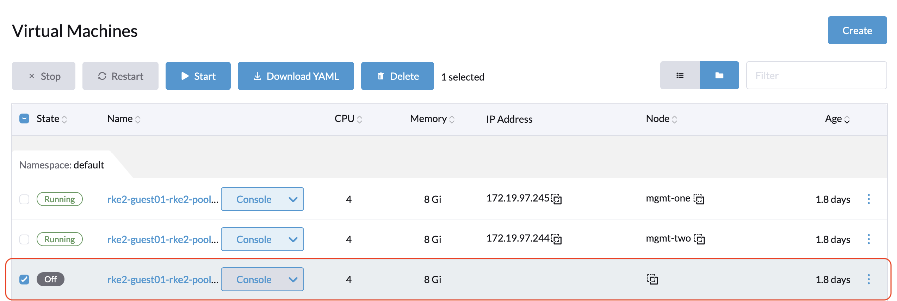
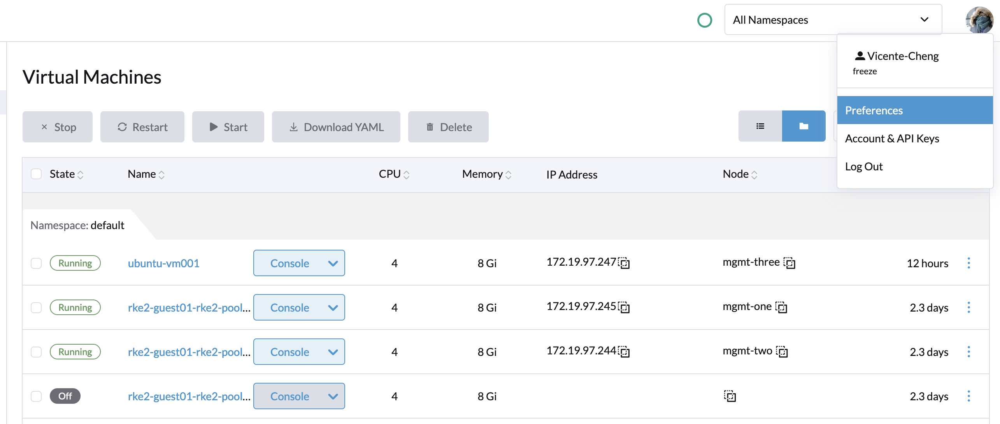
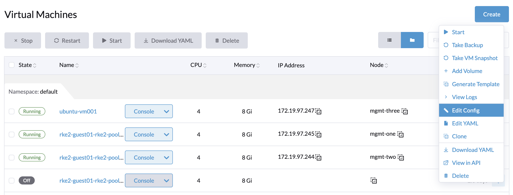
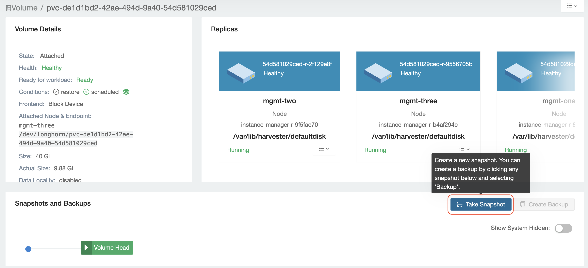
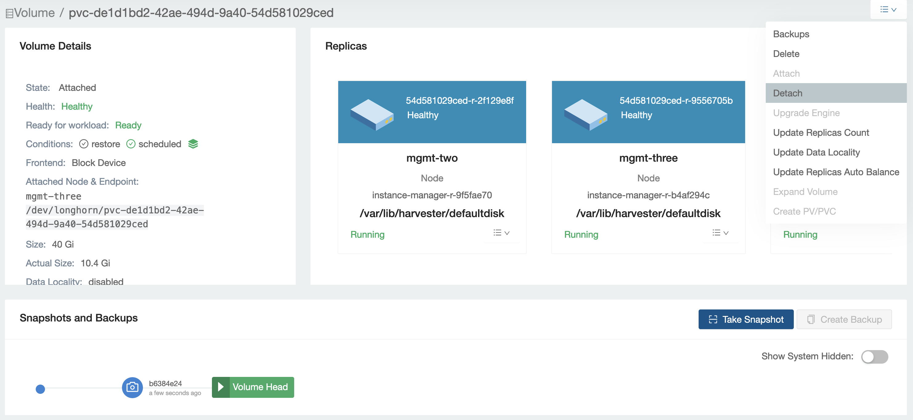
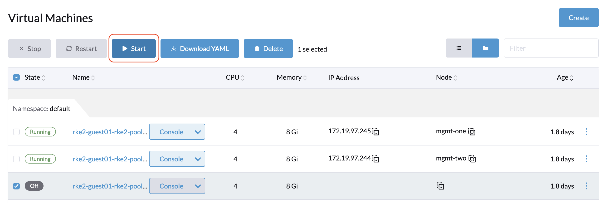

In earlier versions of Harvester (v1.0.3 and prior), Longhorn volumes may get corrupted during the replica rebuilding process (reference: [Analysis: Potential Data/Filesystem Corruption](https://longhorn.io/kb/troubleshooting-volume-filesystem-corruption/#solution)). In Harvester v1.1.0 and later versions, the Longhorn team has fixed this issue. This article covers manual steps you can take to scan the VM's filesystem and repair it if needed.


## Stop The VM And Backup Volume

Before you scan the filesystem, it is recommend you back up the volume first. For an example, refer to the following steps to stop the VM and backup the volume.

- Find the target VM.


- Stop the target VM.



The target VM is stopped and the related volumes are detached. Now go to the Longhorn UI to backup this volume.

- Enable `Developer Tools & Features` (Preferences -> Enable Developer Tools & Features).




- Click the `⋮` button and select **Edit Config** to edit the config page of the VM.



- Go to the `Volumes` tab and select `Check volume details.`


- Click the dropdown menu on the right side and select 'Attach' to attach the volume again. 


- Select the attached node. 


- Check the volume attached under `Volume Details` and select `Take Snapshot` on this volume page.



- Confirm that the snapshot is ready.


Now that you completed the volume backup, you need to scan and repair the root filesystem.

## Scanning the root filesystem and repairing

This section will introduce how to scan the filesystem (e.g., XFS, EXT4) using related tools.

Before scanning, you need to know the filesystem's device/partition.

- Identify the filesystem's device by checking the major and minor numbers of that device.

1. Obtain the major and minor numbers from the listed volume information.
  
  In the following example, the volume name is `pvc-ea7536c0-301f-479e-b2a2-e40ddc864b58`.
  ```
  harvester-node-0:~ # ls /dev/longhorn/pvc-ea7536c0-301f-479e-b2a2-e40ddc864b58 -al
  brw-rw---- 1 root root 8, 0 Oct 23 14:43 /dev/longhorn/pvc-ea7536c0-301f-479e-b2a2-e40ddc864b58
  ```
  The output indicates that the major and minor numbers are `8:0`.
  
2. Obtain the device name from the output of the `lsblk` command.
  ```
  harvester-node-0:~ # lsblk
  NAME   MAJ:MIN RM   SIZE RO TYPE MOUNTPOINTS
  loop0    7:0    0     3G  1 loop /
  sda      8:0    0    40G  0 disk
  ├─sda1   8:1    0     2M  0 part
  ├─sda2   8:2    0    20M  0 part
  └─sda3   8:3    0    40G  0 part
  ```
  The output indicates that `8:0` are the major and minor numbers of the device named `sda`. Therefore, `/dev/sda` is related to the volume named `pvc-ea7536c0-301f-479e-b2a2-e40ddc864b58`.

- You should now know the filesystem's partition. In the example below, sda3 is the filesystem's partition.
- Use the Filesystem toolbox image to scan and repair.

```
# docker run -it --rm --privileged registry.opensuse.org/isv/rancher/harvester/toolbox/main/fs-toolbox:latest -- bash
```

Then we try to scan with this target device.

### XFS

When scanning an XFS filesystem, use the `xfs_repair` command and specify the problematic partition of the device.

In the following example, `/dev/sda3` is the problematic partition.
```
# xfs_repair -n /dev/sda3
```

To repair the corrupted partition, run the following command.

```
# xfs_repair /dev/sda3
```

### EXT4

When scanning a EXT4 filesystem, use the `e2fsck` command as follows, where the `/dev/sde1` is the problematic partition of the device.

```
# e2fsck -f /dev/sde1
```

To repair the corrupted partition, run the following command.

```
# e2fsck -fp /dev/sde1
```


After using the 'e2fsck' command, you should also see logs related to scanning and repairing the partition. Scanning and repairing the corrupted partition is successful if there are no errors in these logs. 


## Detach and Start VM again.

After the corrupted partition is scanned and repaired, detach the volume and try to start the related VM again.

- Detach the volume from the Longhorn UI.



- Start the related VM again from the Harvester UI.



Your VM should now work normally.
