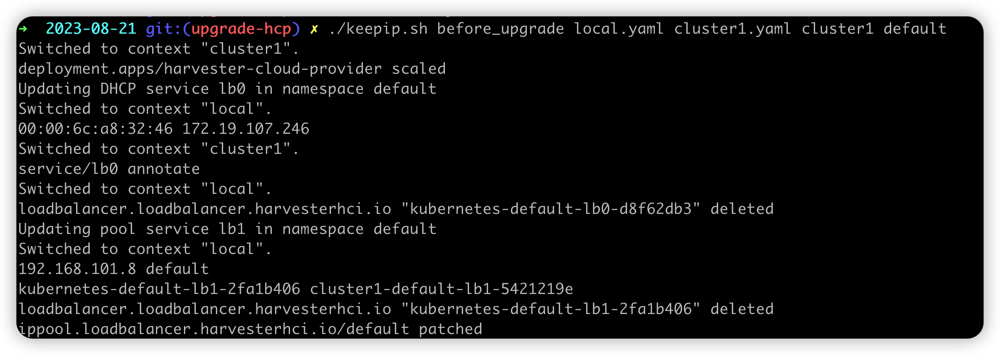
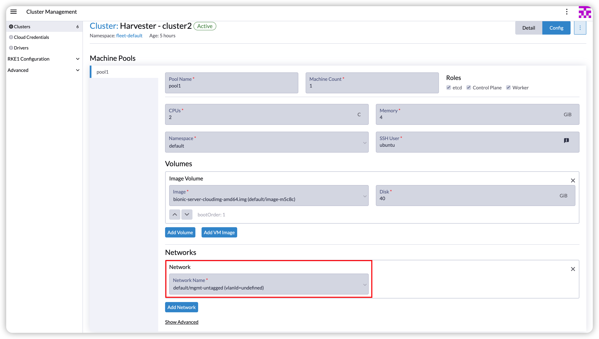
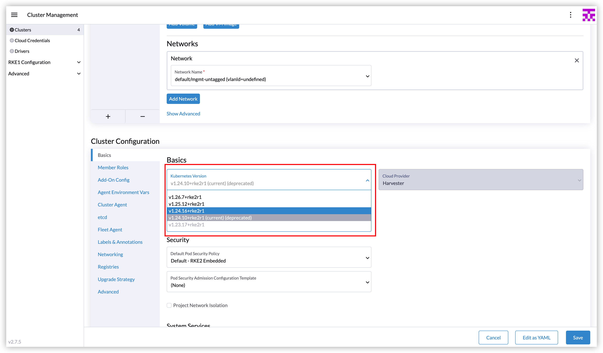

As **Harvester v1.2.0** is released, a new Harvester cloud provider version **0.2.2** is integrated into RKE2 **v1.24.15+rke2r1**, **v1.25.11+rke2r1**,  **v1.26.6+rke2r1**, **v1.27.3+rke2r1**, and newer versions.

With Harvester v1.2.0, the new Harvester cloud provider offers enhanced load balancing capabilities for guest Kubernetes services. Specifically, it introduces the Harvester IP Pool feature, a built-in IP address management (IPAM) solution for the Harvester load balancer. It allows you to define an IP pool specific to a particular guest cluster by specifying the guest cluster name. For example, you can create an IP pool exclusively for the guest cluster named cluster2:


However, after upgrading, the feature is not automatically compatible with existing guest Kubernetes clusters, as they do not pass the correct cluster name to the Harvester cloud provider. Refer to [issue 4232](https://github.com/harvester/harvester/issues/4232) for more details. Users can manually upgrade the Harvester cloud provider using Helm as a workaround and provide the correct cluster name after upgrading. However, this would result in a change in the load balancer IPs. 

This article outlines a workaround that allows you to leverage the new IP pool feature while keeping the load balancer IPs unchanged.

## Prerequisites

- Download the Harvester kubeconfig file from the Harvester UI. If you have imported Harvester into Rancher, do not use the kubeconfig file from the Rancher UI. Refer to [Access Harvester Cluster](https://docs.harvesterhci.io/v1.1/faq#how-can-i-access-the-kubeconfig-file-of-the-harvester-cluster) to get the desired one.

- Download the kubeconfig file for the guest Kubernetes cluster you plan to upgrade. Refer to [Accessing Clusters with kubectl from Your Workstation](https://ranchermanager.docs.rancher.com/how-to-guides/new-user-guides/manage-clusters/access-clusters/use-kubectl-and-kubeconfig#accessing-clusters-with-kubectl-from-your-workstation) for instructions on how to download the kubeconfig file.

## Steps to Keep Load Balancer IP

1. Execute the following script before upgrading.
   ```
   curl -sfL https://raw.githubusercontent.com/harvester/harvesterhci.io/main/kb/2023-08-21/keepip.sh | sh -s before_upgrade <Harvester-kubeconfig-path> <guest-cluster-kubeconfig-path> <guest-cluster-name> <guest-cluster-nodes-namespace>
   ```

   - `<Harvester-kubeconfig-path>`: Path to the Harvester kubeconfig file.
   - `<guest-cluster-kubeconfig-path>`: Path to the kubeconfig file of your guest Kubernetes cluster.
   - `<guest-cluster-name>`: Name of your guest cluster.
   - `<guest-cluster-nodes-namespace>`: Namespace where the VMs of the guest cluster are located.

   The script will help users copy the DHCP information to the service annotation and modify the IP pool allocated history to make sure the IP is unchanged.

   

   After executing the script, the load balancer service with DHCP mode will be annotated with the DHCP information. For example:

   ``` yaml
   apiVersion: v1
   kind: Service
   metadata:
     annotations:
       kube-vip.io/hwaddr: 00:00:6c:4f:18:68
       kube-vip.io/requestedIP: 172.19.105.215
     name: lb0
     namespace: default
   ```

   As for the load balancer service with pool mode, the IP pool allocated history will be modified as the new load balancer name. For example:

   ``` yaml
   apiVersion: loadbalancer.harvesterhci.io/v1beta1
   kind: IPPool
   metadata:
     name: default
   spec:
     ...
   status:
     allocatedHistory:
       192.168.100.2: default/cluster-name-default-lb1-ddc13071 # replace the new load balancer name
   ```

2. Add network selector for the pool.

  For example, the following cluster is under the VM network `default/mgmt-untagged`. The network selector should be `default/mgmt-untagged`.

  

  

3. Upgrade the RKE2 cluster in the Rancher UI and select the new version.
  
  

1. Execute the script after upgrading.
   ```
   curl -sfL https://raw.githubusercontent.com/harvester/harvesterhci.io/main/kb/2023-08-21/keepip.sh | sh -s after_upgrade <Harvester-kubeconfig-path> <guest-cluster-kubeconfig-path> <guest-cluster-name> <guest-cluster-nodes-namespace>
   ```
  
   
   In this step, the script wraps the operations to upgrade the Harvester cloud provider to set the cluster name. After the Harvester cloud provider is running, the new Harvester load balancers will be created with the unchanged IPs.