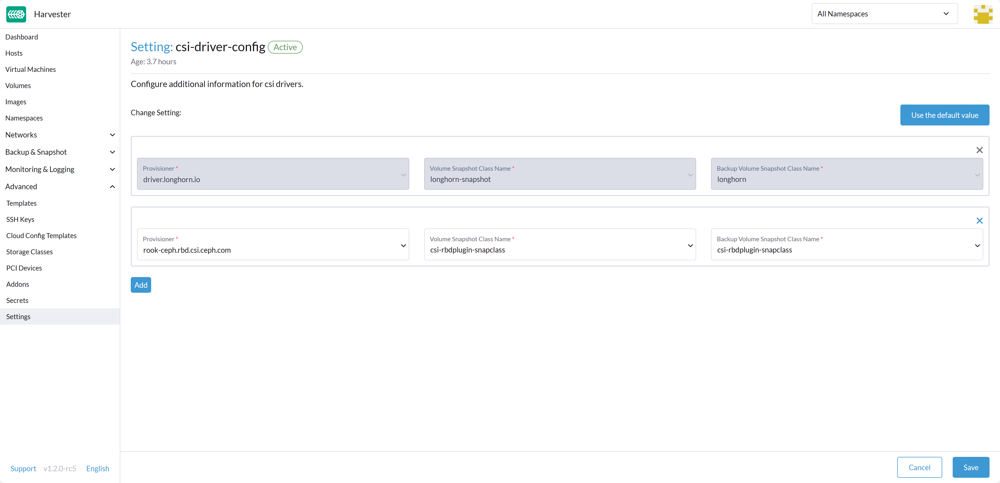
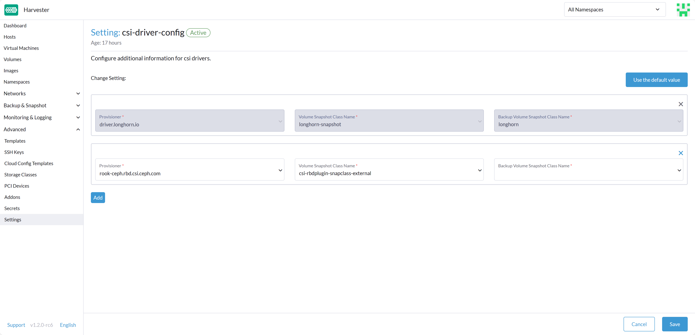
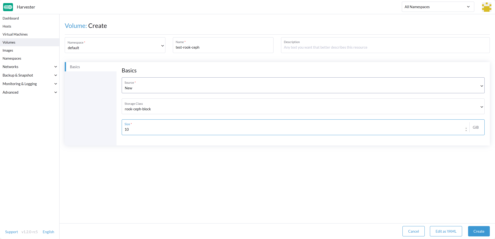
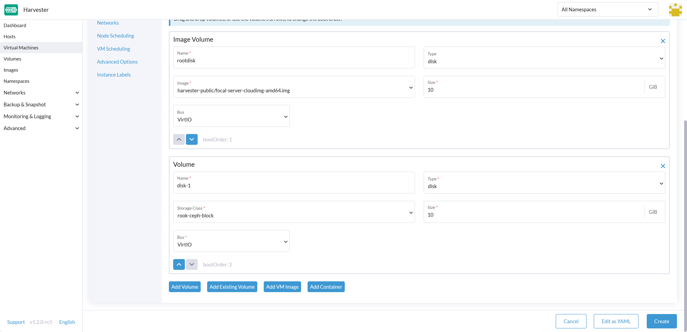

Starting with Harvester v1.2.0, it offers the capability to install a Container Storage Interface (CSI) in your Harvester cluster. This allows you to leverage external storage for the Virtual Machine's non-system data disk, giving you the flexibility to use different drivers tailored for specific needs, whether it's for performance optimization or seamless integration with your existing in-house storage solutions.

It's important to note that, despite this enhancement, the provisioner for the Virtual Machine (VM) image in Harvester still relies on Longhorn. Prior to version 1.2.0, Harvester exclusively supported Longhorn for storing VM data and did not offer support for external storage as a destination for VM data.

One of the options for integrating external storage with Harvester is Rook, an open-source cloud-native storage orchestrator. Rook provides a robust platform, framework, and support for Ceph storage, enabling seamless integration with cloud-native environments.

[Ceph](https://ceph.io) is a software-defined distributed storage system that offers versatile storage capabilities, including file, block, and object storage. It is designed for large-scale production clusters and can be deployed effectively in such environments.

[Rook](https://rook.io) simplifies the deployment and management of Ceph, offering self-managing, self-scaling, and self-healing storage services. It leverages Kubernetes resources to automate the deployment, configuration, provisioning, scaling, upgrading, and monitoring of Ceph.

In this article, we will walk you through the process of installing, configuring, and utilizing [Rook Ceph](https://rook.io/docs/rook/v1.12/Getting-Started/intro/) as a data disk for a VM within the Harvester environment.

## Install Harvester Cluster

Harvester's operating system follows an immutable design, meaning that most OS files revert to their pre-configured state after a reboot. To accommodate Rook Ceph's requirements, you need to add specific persistent paths to the `os.persistentStatePaths` section in the [Harvester configuration](https://docs.harvesterhci.io/dev/install/harvester-configuration#ospersistent_state_paths). These paths include:

```yaml
os:
  persistent_state_paths:
    - /var/lib/rook
    - /var/lib/ceph
  modules:
    - rbd
    - nbd
```

After the cluster is installed, refer to [How can I access the kubeconfig file of the Harvester cluster?](https://docs.harvesterhci.io/v1.1/faq#how-can-i-access-the-kubeconfig-file-of-the-harvester-cluster) to get the kubeconfig of the Harvester cluster.

## Install Rook to Harvester

Install Rook to the Harvester cluster by referring to [Rook Quickstart](https://rook.io/docs/rook/v1.12/Getting-Started/quickstart/).

```bash
curl -fsSLo rook.tar.gz https://github.com/rook/rook/archive/refs/tags/v1.12.2.tar.gz \
  && tar -zxf rook.tar.gz && cd rook-1.12.2/deploy/examples
# apply configurations ref: https://rook.github.io/docs/rook/v1.12/Getting-Started/example-configurations/
kubectl apply -f crds.yaml -f common.yaml -f operator.yaml
kubectl -n rook-ceph wait --for=condition=Available deploy rook-ceph-operator --timeout=10m
```

## Setup the Ceph Cluster

### Option 1: Create a new Ceph cluster using free disks on the Harvester hosts

1. Create a new Ceph cluster.
```bash
# apply configurations ref: https://rook.github.io/docs/rook/v1.12/Getting-Started/example-configurations/#cluster-crd
kubectl apply -f cluster.yaml
```

2. Create the StorageClass `rook-ceph-block` and VolumeSnapshotClass `csi-rbdplugin-snapclass`.

```bash
kubectl apply -f ./csi/rbd/storageclass.yaml -f ./csi/rbd/snapshotclass.yaml
```


### Option 2: Using an existing external Ceph cluster (Recommended)

1. Run the python script `create-external-cluster-resources.py` in the [existing external Ceph cluster](https://www.rook.io/docs/rook/v1.12/CRDs/Cluster/external-cluster/) for creating all users and keys.
```bash
# script help ref: https://www.rook.io/docs/rook/v1.12/CRDs/Cluster/external-cluster/#1-create-all-users-and-keys
curl -s https://raw.githubusercontent.com/rook/rook/v1.12.2/deploy/examples/create-external-cluster-resources.py > create-external-cluster-resources.py
python3 create-external-cluster-resources.py --rbd-data-pool-name <pool_name> --namespace rook-ceph-external --format bash
```

2. Copy the Bash output.

Example output:
```
export NAMESPACE=rook-ceph-external
export ROOK_EXTERNAL_FSID=b3b47828-4c60-11ee-be38-51902f85c805
export ROOK_EXTERNAL_USERNAME=client.healthchecker
export ROOK_EXTERNAL_CEPH_MON_DATA=ceph-1=192.168.5.99:6789
export ROOK_EXTERNAL_USER_SECRET=AQDd6/dkFyu/IhAATv/uCMbHtWk4AYK2KXzBhQ==
export ROOK_EXTERNAL_DASHBOARD_LINK=https://192.168.5.99:8443/
export CSI_RBD_NODE_SECRET=AQDd6/dk2HsjIxAA06Yw9UcOg0dfwV/9IFBRhA==
export CSI_RBD_NODE_SECRET_NAME=csi-rbd-node
export CSI_RBD_PROVISIONER_SECRET=AQDd6/dkEY1kIxAAAzrXZnVRf4x+wDUz1zyaQg==
export CSI_RBD_PROVISIONER_SECRET_NAME=csi-rbd-provisioner
export MONITORING_ENDPOINT=192.168.5.99
export MONITORING_ENDPOINT_PORT=9283
export RBD_POOL_NAME=test
export RGW_POOL_PREFIX=default
```

3. Consume the external Ceph cluster resources on the Harvester cluster.

```bash
# Paste the above output from create-external-cluster-resources.py into import-env.sh
vim import-env.sh
source import-env.sh
# this script will create a StorageClass ceph-rbd
source import-external-cluster.sh
```

```bash
kubectl apply -f common-external.yaml
kubectl apply -f cluster-external.yaml
# wait for all pods to become Ready
watch 'kubectl --namespace rook-ceph get pods'
```

4. Create the VolumeSnapshotClass `csi-rbdplugin-snapclass-external`.

```bash
cat >./csi/rbd/snapshotclass-external.yaml <<EOF
---
apiVersion: snapshot.storage.k8s.io/v1
kind: VolumeSnapshotClass
metadata:
  name: csi-rbdplugin-snapclass-external
driver: rook-ceph.rbd.csi.ceph.com # driver:namespace:operator
parameters:
  clusterID: rook-ceph-external # namespace:cluster
  csi.storage.k8s.io/snapshotter-secret-name: rook-csi-rbd-provisioner
  csi.storage.k8s.io/snapshotter-secret-namespace: rook-ceph-external # namespace:cluster
deletionPolicy: Delete
EOF

kubectl apply -f ./csi/rbd/snapshotclass-external.yaml
```

## Configure Harvester Cluster

Before you can make use of Harvester's **Backup & Snapshot** features, you need to set up some essential configurations through the Harvester [csi-driver-config](https://docs.harvesterhci.io/v1.2/advanced/settings#csi-driver-config) setting. To set up these configurations, follow these steps:

1. Login to the Harvester UI, then navigate to **Advanced** > **Settings**.
1. Find and select **csi-driver-config**, and then click on the **⋮** > **Edit Setting** to access the configuration options.
1. In the settings, set the **Provisioner** to `rook-ceph.rbd.csi.ceph.com`.
1. Next, specify the **Volume Snapshot Class Name** as `csi-rbdplugin-snapclass` for the internal Ceph cluster or `csi-rbdplugin-snapclass-external` for the external Ceph cluster. This setting points to the name of the `VolumeSnapshotClass` used for creating volume snapshots or VM snapshots.
1. Similarly, set the **Backup Volume Snapshot Class Name** to `csi-rbdplugin-snapclass` or `csi-rbdplugin-snapclass-external`. This corresponds to the name of the `VolumeSnapshotClass` responsible for creating VM backups.





## Use Rook Ceph in Harvester

After successfully configuring these settings, you can proceed to utilize the Rook Ceph StorageClass, which is named `rook-ceph-block` for the internal Ceph cluster or named `ceph-rbd` for the external Ceph cluster. You can apply this StorageClass when creating an empty volume or adding a new block volume to a VM, enhancing your Harvester cluster's storage capabilities.

With these configurations in place, your Harvester cluster is ready to make the most of the Rook Ceph storage integration.






