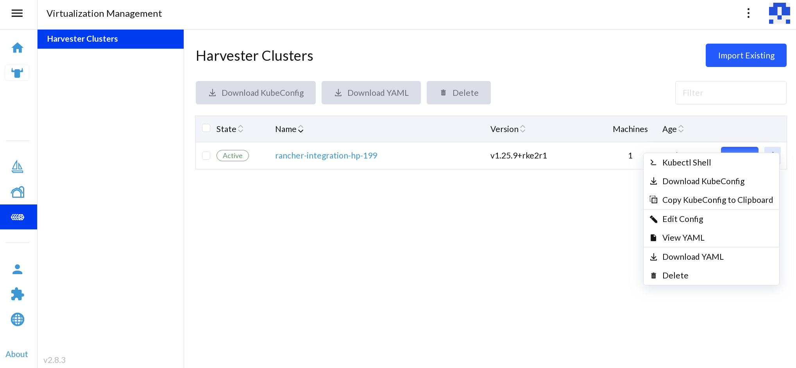

## Expiration of kubeconfig Tokens in Rancher 2.8.x

In Rancher 2.8.x, the default value of the [kubeconfig-default-token-ttl-minutes](https://ranchermanager.docs.rancher.com/api/api-tokens#kubeconfig-default-token-ttl-minutes) setting is `30` days.

A side effect of using this default value is the expiration of authentication tokens embedded in kubeconfigs that Rancher uses to provision guest Kubernetes clusters on Harvester. When such tokens expire, Rancher loses the ability to perform management operations for the corresponding Rancher-managed guest Kubernetes clusters. [Issue #44912](https://github.com/rancher/rancher/issues/44912) tracks the issue described in this article.

:::note
The issue affects only guest Kubernetes clusters running on Harvester that use cloud credentials created after installing or upgrading to Rancher v2.8.x.
:::

## Workaround

You can patch the expired Harvester cloud credentials to use a new authentication token.

1. Identify the expired cloud credentials and which Harvester cluster is
   affected by them.

  

1. Download a new kubeconfig file for the affected Harvester cluster.

  

1. Patch the cloud credentials. The cloud credential is stored as a secret in `cattle-global-data` namespace, and can be replaced with the new kubeconfig file. Ensure that the environment variable `KUBECONFIG_FILE` contains the path to the new kubeconfig file.

  ```shell
  #!/bin/sh
  CLOUD_CREDENTIAL_NAME=$1
  KUBECONFIG_FILE=$2

  kubeconfig="$(base64 -w 0 "${KUBECONFIG_FILE}")"

  patch_file=$(mktemp)

  cat > ${patch_file} <<EOF
  data:
    harvestercredentialConfig-kubeconfigContent: $kubeconfig
  EOF

  kubectl patch secret ${CLOUD_CREDENTIAL_NAME} -n cattle-global-data --patch-file ${patch_file} --type merge
  rm ${patch_file}
  ```

  :::info important
  macOS users must use `gbase64` to ensure that the `-w` flag is supported.
  :::
