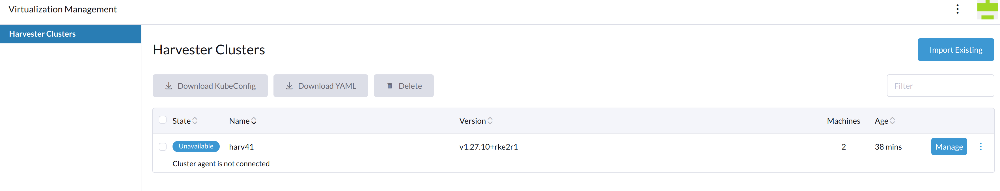

Scenarios:

1. The Harvester cluster is installed with 3+ nodes.

1. The **Rancher manager/server** is deployed independently. (Hereafter it is mentioned as `Rancher manager`)

1. The Harvester cluster is imported to this Rancher manager and works as a node driver.

1. The Rancher manager deploys a couple of downstream k8s clusters, the machines/nodes of those clusters are backed by Harvester VMs.

1. There are also some traditional VMs deployed on the Harvester cluster, which have no direct connection with the Rancher manager.

You plan to move those Harvester nodes geographically, or to power off the whole cluster for some time, it is essential to shutdown the Harvester cluster and restart later.

:::note

2 3 4 are optional if your Harvester cluster is mainly running as an IaaS component. This instruction covers all the above scenarios.

:::

## General Principle

To safely shutdown a Harvester cluster, you need to follow the roughly reverse order of the cluster installation and the workload deployments.

Those facts need to be taken into account particularly:

1. The common methodology of kubernetes operator/controller is to try things continuously until they meet expectations. When the cluster is shutting down node by node, if you don't stop those workloads in advance, they will try hard until the last node is off. It causes the last few nodes to have heavy CPU/memory/network/storage usage and increases the chance of data corruption.

1. Each Harvester node has limited capacity of CPU/memory/network/storage and the max-pod-number, when all workloads are crowded on the last few nodes, the unexpected pod eviction, scheduling failure and other phenomena may happen.

1. Harvester has embedded Longhorn as the default CSI driver, each PV can have 3 or more replicas, when replicas are rescheduled to other nodes, Longhorn will copy data from source node and rebuild the replica. Undoubtedly, stop the PVs as much as possible before the cluster shutdown to avoid the data moving.

1. Unlike normal kubernetes deployments which have no PVs and are more flexible & agile to deploy anywhere on the cluster, the VMs are backed by massive sized PVs, slowly to move/migrate or even pinned on certain nodes to take the advantage of pci-passthrough/vgpu/... and much more sensitive to data consistency.

Needless to say, it is a bad practice to brutally power off the nodes on production environments.

## 1. Precondition

### 1.1 Generate a support-bundle file

For trouble-shooting purpose, it is essential to follow [this instruction](https://docs.harvesterhci.io/v1.3/troubleshooting/harvester#generate-a-support-bundle) to generate a support-bundle file before taking any actions. And make sure the [workload namespaces are added](https://docs.harvesterhci.io/v1.3/advanced/index#support-bundle-namespaces).

### 1.2 Keep Network Stability

:::info important

Harvester cluster is built on top of Kubernetes, a general requirement is that the Node/Host IP and the cluster VIP should keep stable in the whole lifecycle, if IP changes the cluster will fail to work as expected.

If your VMs on Harvester are used as Rancher downstream cluster machines/nodes, and their IPs are allocated from DHCP server, also make sure those VMs will still get the same IPs after the Harvester cluster is rebooted and VMs are restarted.

:::

A good practice is to have detailed documents about the infrastructure related settings.

- The bare metal server nic slot/port connections with the remote (ToR) Switches.

- The VLAN for the management network.

- (Optional) The DHCP Server, ip-pools and ip-mac bindings for the Harvester cluster if DHCP server is used. If there is no fixed ip binding, when the server restarts after some days it may get a different IP from the DHCP server.

- The [VLANs for the VM networks](https://docs.harvesterhci.io/v1.3/networking/harvester-network#vlan-network), the CIDRs, default gateways and optional DHCP servers.

- [NTP servers](https://docs.harvesterhci.io/v1.3/advanced/index#ntp-servers).

- DNS servers.

- (Optional) The [http proxy](https://docs.harvesterhci.io/v1.3/advanced/index#http-proxy).

- (Optional) The private [containerd-registry](https://docs.harvesterhci.io/v1.3/advanced/index#containerd-registry).

- (Optional) The firewall configurations.

See the [Harvester ISO Installation](https://docs.harvesterhci.io/v1.3/install/index) to review the infrastructure related settings for the Harvester cluster.

Before the Harvester cluster is restarted later, check and test those settings again to make sure the infrastructure is ready.

## 2. Backup

### (Optional) Backup VMs if possible

It is always a good practice to backup things before a whole cluster shutdown.

### (Optional) Backup Downstream k8s Clusters if possible

Harvester doesn't touch the (Rancher manager managed) downstream k8s clusters' workload, when they are not able to be migrated to other node drivers, suggests to backup those clusters.

### (Optional) Stop or Migrate Downstream k8s Clusters if possible

Harvester doesn't touch the downstream k8s clusters' workload, but suggests to stop or migrate the downstream clusters to avoid your service interruption.

## 3. Shutdown Workloads

### 3.1 Shutdown Traditional VMs

1. Shutdown VM from the VM shell (e.g. Linux `shutdown` command), the OS itself will save data to disks.

2. Check the VM status from [Harvester UI - VM page](https://docs.harvesterhci.io/v1.3/troubleshooting/vm#vm-general-operations), when it is not `Off`, then click the `Stop` command.

### 3.2 Shutdown Rancher downstream cluster machines(VMs)

Your Harvester cluster was [imported to Rancher](https://docs.harvesterhci.io/v1.3/rancher/virtualization-management) as a [node driver](https://docs.harvesterhci.io/v1.3/rancher/rancher-integration#creating-kubernetes-clusters-using-the-harvester-node-driver) before.

When Rancher deploys a downstream cluster on node driver Harvester, it creates a couple of VMs on Harvester automatically. Directly stopping those VMs on Harvester is not a good practice when Rancher is still managing the downstream cluster. For example, Rancher will create new VMs if you stop them from Harvester.

If you have got a solution to **shutdown** those downstream clusters, then check those VMs are `Off`; or there is no downstream clusters, then jump to next step [disable some addons](#33-disable-some-addons).

Unless you have already deleted all the downstream clusters which are deploy on this Harvester, **DO NOT** [remove this imported Harvester from the Rancher manager](https://docs.harvesterhci.io/v1.3/rancher/virtualization-management#delete-imported-harvester-cluster). Harvester will get a different driver-id when it is imported later, but those aforementioned downstream clusters are connected to driver-id.

To safely shutdown those VMs but still keep the Rancher manager managed downstream cluster `alive`, please follow the steps below:

#### Disconnect Harvester from the Rancher manager

:::note

Harvester has an embedded rancher deployment which is used to help the lifecycle management of Harvester itself, it is different from the independently deployed **Rancher manager** for multi-cluster management and more.

:::

All following CLI commands are executed upon **Harvester** cluster.

1. Set the `management.cattle.io/scale-available` of `deployment rancher` to be `""` instead of `"3"` or other values.

This change will stop the auto-scaling.

```
harvester$ kubectl edit deployment -n cattle-system rancher
apiVersion: apps/v1
kind: Deployment
metadata:
  annotations:
...
    management.cattle.io/scale-available: "3"  // record this value, and change it to ""
...
  generation: 16
  labels:
    app: rancher
    app.kubernetes.io/managed-by: Helm
...
  name: rancher
  namespace: cattle-system
```

2. Scale down the Rancher deployment.

```
harvester$ kubectl scale deployment -n cattle-system rancher --replicas=0
deployment.apps/rancher scaled


harvester$ get deployment -n cattle-system rancher
NAME      READY   UP-TO-DATE   AVAILABLE   AGE
rancher   0/0     0            0           33d
```

3. Make sure the rancher pods are gone.

Check the `rancher-*` pods on `cattle-system` are gone, if any of them is stucking at `Terminating`, use `kubectl delete pod -n cattle-system rancher-pod-name --force` to delete it.

```
harvester$ kubectl get pods -n cattle-system
NAME                                         READY   STATUS        RESTARTS       AGE
..
rancher-856f674f7d-5dqb6                     0/1     Terminating   0              3d22h
rancher-856f674f7d-h4vsw                     1/1     Running       23 (68m ago)   33d
rancher-856f674f7d-m6s4r                     0/1     Pending       0              3d19h
...
```

Please note:

1. From now on, this Harvester is `Unavailable` on the Rancher manager.



2. The Harvester Webui returns `503 Service Temporarily Unavailable`, all following options can be done via `kubectl`.


#### Shutdown Rancher downstream cluster machines(VMs)

1. Shutdown VM from the VM shell (e.g. Linux `shutdown` command).

2. Check the `vmi` instances, if any is still `Running`, stop it.

```
harvester$ kubectl get vmi
NAMESPACE   NAME   AGE    PHASE     IP            NODENAME   READY
default     vm1    5m6s   Running   10.52.0.214   harv41     True


harvester$ virtctl stop vm1 --namespace default
VM vm1 was scheduled to stop

harvester$ kubectl get vmi -A
NAMESPACE   NAME   AGE    PHASE     IP            NODENAME   READY
default     vm1    5m6s   Running   10.52.0.214   harv41     False


harvester$ kubectl get vmi -A
No resources found

harvester$ kubectl get vm -A
NAMESPACE   NAME   AGE   STATUS    READY
default     vm1    7d    Stopped   False
```

### 3.3 Disable some addons

Harvester has some addons which are backed by PVCs, it is necessary to disable them.

The `rancher-monitoring` addon should be disabled.

The experimental [Rancher Manager addon](https://docs.harvesterhci.io/v1.3/advanced/addons/rancher-vcluster) should be disabled.

For other addons, please follow the Harvester document to keep or disable them.

From Harvester UI [addon page](https://docs.harvesterhci.io/v1.3/advanced/addons), write down those none-Disabled addons, click `Disable` menu to disable them, wait until the state becomes `Disabled`

From CLI:

```
$ kubectl get addons.harvesterhci.io -A

NAMESPACE                  NAME                    HELMREPO                                                 CHARTNAME                         ENABLED
cattle-logging-system      rancher-logging         http://harvester-cluster-repo.cattle-system.svc/charts   rancher-logging                   false
cattle-monitoring-system   rancher-monitoring      http://harvester-cluster-repo.cattle-system.svc/charts   rancher-monitoring                true
harvester-system           harvester-seeder        http://harvester-cluster-repo.cattle-system.svc/charts   harvester-seeder                  false
harvester-system           nvidia-driver-toolkit   http://harvester-cluster-repo.cattle-system.svc/charts   nvidia-driver-runtime             false
harvester-system           pcidevices-controller   http://harvester-cluster-repo.cattle-system.svc/charts   harvester-pcidevices-controller   false
harvester-system           vm-import-controller    http://harvester-cluster-repo.cattle-system.svc/charts   harvester-vm-import-controller    false

Example: disable rancher-monitoring

$ kubectl edit addons.harvesterhci.io -n cattle-monitoring-system rancher-monitoring

...
spec:
  chart: rancher-monitoring
  enabled: false               // set this field to be false
...

```

### 3.4  (Optional) Disable other workloads

If you have deployed some customized workloads on the Harvester cluster directly, it is better to disable/remove them.

### 3.5  Check Longhorn volumes

The volumes should be in state `detached`, check the related workload if some volumes are still in state `attached`.

```
harvester$ kubectl get volume -A
NAMESPACE         NAME                                       DATA ENGINE   STATE      ROBUSTNESS   SCHEDULED   SIZE          NODE     AGE
longhorn-system   pvc-3323944c-00d9-4b35-ae38-a00b1e8a8841   v1            detached   unknown                  5368709120             13d
longhorn-system   pvc-394713a4-d08c-4a45-bf7a-d44343f29dea   v1            attached   healthy                  6442450944    harv41   8d    // still attached and in use
longhorn-system   pvc-5cf00ae2-e85e-413e-a4f1-8bc4242d4584   v1            detached   unknown                  2147483648             13d
longhorn-system   pvc-620358ca-94b3-4bd4-b008-5c144fd815c9   v1            attached   healthy                  2147483648    harv41   8d    // still attached and in use
longhorn-system   pvc-8174f05c-919b-4a8b-b1ad-4fc110c5e2bf   v1            detached   unknown                  10737418240            13d
```

## 4. Shutdown nodes

Get all nodes from Harvester WebUI [Host Management](https://docs.harvesterhci.io/v1.3/host/).

From CLI:

```
harvester$ kubectl get nodes -A
NAME     STATUS     ROLES                       AGE    VERSION
harv2    NotReady   <none>                      4d6h   v1.27.10+rke2r1
harv41   Ready      control-plane,etcd,master   34d    v1.27.10+rke2r1
```

### 4.1 Shutdown the worker nodes, witness node

1. Ssh to the Harvester worker nodes, witness node.

2. Run command `sudo -i shutdown`.

```
$ sudo -i shutdown

Shutdown scheduled for Mon 2024-07-22 06:58:56 UTC, use 'shutdown -c' to cancel.
```

3. Wait until all those nodes are downs

### 4.2 Shutdown control-plane nodes

To now, there are generally three control-plane nodes left, and three `etcd-*` pods are running in `kube-system` namespaces.

The first step is to find which one of the `etcd-*` pod is running as the leader.

Run below command upon any of the `tecd-*` pod, note the `IS LEADER` column.

```
$ kubectl exec -n kube-system etcd-harv41 -- env ETCDCTL_API=3 etcdctl endpoint status --cluster -w table --cacert /var/lib/rancher/rke2/server/tls/etcd/server-ca.crt --cert /var/lib/rancher/rke2/server/tls/etcd/server-client.crt --key /var/lib/rancher/rke2/server/tls/etcd/server-client.key

+------------------------------+------------------+---------+---------+-----------+------------+-----------+------------+--------------------+--------+
|           ENDPOINT           |        ID        | VERSION | DB SIZE | IS LEADER | IS LEARNER | RAFT TERM | RAFT INDEX | RAFT APPLIED INDEX | ERRORS |
+------------------------------+------------------+---------+---------+-----------+------------+-----------+------------+--------------------+--------+
| https://192.168.122.141:2379 | c70780b7862269c9 |   3.5.9 |   34 MB |      true |      false |        45 |    6538829 |            6538829 |        |
+------------------------------+------------------+---------+---------+-----------+------------+-----------+------------+--------------------+--------+
```

:::note important

Write down the information of those nodes like name, ip, and the leader. Ideally give them a sequence like 1, 2, 3.

:::

Shutdown the two `IS LEADER == false` nodes one by one.

```
harvester-node-shell$ sudo -i shutdown
```

### 4.2 Shutdown the last control-plane node

Shutdown the last `IS LEADER == true` node. Remember its physical information for restarting first in the steps below.

```
harvester-last-node-shell$ sudo -i shutdown
```

## 5. Restart

If the Harvester cluster has been moved to a new location, or has been off for days, or your infrastructure has changes, check and test the [network stability](#12-keep-network-stability).

### 5.1 Restart the control-plane nodes

#### Restart the leader control-plane node

Start the [last shutdown node](#4.2-shutdown-the-last-control-plan-node) first.

Wait until the Harvester UI is accessible and this [node on Harvester UI](https://docs.harvesterhci.io/v1.3/host/) is `Active`.

#### Restart the rest of control-plane nodes

Wait until all the three control-plane [nodes on Harvester UI](https://docs.harvesterhci.io/v1.3/host/) are `Active`.

#### Check the VIP

The following `EXTERNAL-IP` should be the same as the VIP of the Harvester cluster.

```
harvester$ kubectl get service -n kube-system ingress-expose
NAME             TYPE           CLUSTER-IP     EXTERNAL-IP       PORT(S)                      AGE
ingress-expose   LoadBalancer   10.53.50.107   192.168.122.144   443:32701/TCP,80:31480/TCP   34d
```

### 5.2 Restart the worker nodes and witness node

Wait until all [nodes on Harvester UI](https://docs.harvesterhci.io/v1.3/host/) are `Active`.

### 5.3 Enable addons

Enable those previously disabled addons, wait until they are `DepoloySuccessful`.

### 5.4 Restore the Connection to the Rancher manager

Run following 1, 2 commands on the Harvester cluster.

1. Set the `management.cattle.io/scale-available` of `rancher deployment` to be the value recorded on the above steps.

This change will enable the auto-scaling.

```
harvester$ kubectl edit deployment -n cattle-system rancher
apiVersion: apps/v1
kind: Deployment
metadata:
  annotations:
...
    management.cattle.io/scale-available: "3"  // record in above steps
...
  generation: 16
  labels:
    app: rancher
    app.kubernetes.io/managed-by: Helm
...
  name: rancher
  namespace: cattle-system
```

2. Scale up the rancher deployment on Harvester cluster.

```
harvester$ kubectl scale deployment -n cattle-system rancher --replicas=3
deployment.apps/rancher scaled

harvester$ get deployment -n cattle-system rancher
NAME      READY   UP-TO-DATE   AVAILABLE   AGE
rancher   0/0     0            0           33d

```

3. Check the virtualization management on the Rancher manager.

The Harvester cluster continues to be [active on the Rancher Virtualization Management](https://docs.harvesterhci.io/v1.3/rancher/virtualization-management) .

4. Check the Harvester cluster WebUI.

You should be able to access the Harvester WebUI again.

### 5.5 Start VMs

#### 5.1 Start Traditional VMs

When there are many VMs deployed on the cluster, don't start all at the same time, suggest starting them group by group.

Wait until they are `Running`.

#### 3.2 Rancher downstream cluster machines(VMs)

After the Harvester cluster is re-connected to the `Rancher manager` successfully, the `Rancher manager` will handle the downstream k8s clusters' machines(vms) automatically. Wait until all the downstream clusters are ready.

### 5.6 Generate a new support-bundle file

Generate a new support-bundle file on the Harvester cluster.

Together with the [previously generated support-bundle file](#1.1-generate-a-support-bundle-file), the two files record the cluster settings, configurations and status before shutting down and after rebooting. It is helpful for troubleshooting.
