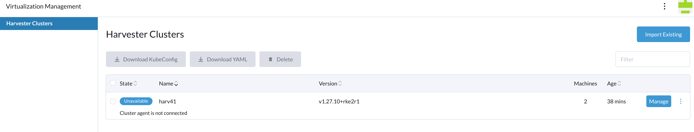

Scenarios:

1. The Harvester cluster is installed with 3+ nodes.

1. The **Rancher Manager/Server** is deployed independently. (Hereafter it is mentioned as `Rancher Manager`)

1. The Harvester cluster is imported to this Rancher Manager and works as a node driver.

1. The Rancher Manager deploys a couple of downstream K8s clusters, the machines/nodes of those clusters are backed by Harvester VMs.

1. There are also some traditional VMs deployed on the Harvester cluster, which have no direct connection with the Rancher Manager.

You plan to move those Harvester nodes geographically, or to power off the whole cluster for some time, it is essential to shutdown the Harvester cluster and restart later.

:::note

2 3 4 are optional if your Harvester cluster is mainly running as an IaaS component. This instruction covers all the above scenarios.

:::

## General Principle

To safely shutdown a Harvester cluster, you need to follow the roughly reverse order of the cluster installation and the workload deployments.

Those facts need to be taken into account particularly:

1. The common methodology of Kubernetes operator/controller is to try things continuously until they meet expectations. When the cluster is shutting down node by node, if you don't stop those workloads in advance, they will try hard until the last node is off. It causes the last few nodes to have heavy CPU/memory/network/storage usage and increases the chance of data corruption.

1. Each Harvester node has limited capacity of CPU/memory/network/storage and the max-pod-number, when all workloads are crowded on the last few nodes, the unexpected pod eviction, scheduling failure and other phenomena may happen.

1. Harvester has embedded Longhorn as the default CSI driver, each PV can have 3 or more replicas, when replicas are rescheduled to other nodes, Longhorn will copy data from source node and rebuild the replica. Undoubtedly, stop the PVs as much as possible before the cluster shutdown to avoid the data moving.

1. Unlike normal Kubernetes deployments which have no PVs and are more flexible & agile to deploy anywhere on the cluster, the VMs are backed by massive sized PVs, slowly to move/migrate or even pinned on certain nodes to take the advantage of PCI-passthrough/vGPU/... and are much more sensitive to data consistency.

Needless to say, it is a bad practice to brutally power off the nodes on production environments.

## 1. Precondition

### 1.1 Generate a Support-bundle File

For trouble-shooting purpose, it is essential to follow [this instruction](https://docs.harvesterhci.io/v1.3/troubleshooting/harvester#generate-a-support-bundle) to generate a support-bundle file before taking any actions. And make sure the [workload namespaces are added](https://docs.harvesterhci.io/v1.3/advanced/index#support-bundle-namespaces).

### 1.2 Keep Network Stability

:::info important

Harvester cluster is built on top of Kubernetes, a general requirement is that the Node/Host IP and the cluster VIP should keep stable in the whole lifecycle, if IP changes the cluster may fail to recover/work.

If your VMs on Harvester are used as Rancher downstream cluster machines/nodes, and their IPs are allocated from DHCP server, also make sure those VMs will still get the same IPs after the Harvester cluster is rebooted and VMs are restarted.

:::

A good practice is to have detailed documents about the infrastructure related settings.

- The bare metal server NIC slot/port connections with the remote (ToR) Switches.

- The VLAN for the management network.

- (Optional) The DHCP Server, ip-pools and ip-mac bindings for the Harvester cluster if DHCP server is used. If there is no fixed IP binding, when the server restarts after some days it may get a different IP from the DHCP server.

- The [VLANs for the VM networks](https://docs.harvesterhci.io/v1.3/networking/harvester-network#vlan-network), the CIDRs, default gateways and optional DHCP servers.

- [NTP servers](https://docs.harvesterhci.io/v1.3/advanced/index#ntp-servers).

- DNS servers.

- (Optional) The [http proxy](https://docs.harvesterhci.io/v1.3/advanced/index#http-proxy).

- (Optional) The private [containerd-registry](https://docs.harvesterhci.io/v1.3/advanced/index#containerd-registry).

- (Optional) The firewall configurations.

See the [Harvester ISO Installation](https://docs.harvesterhci.io/v1.3/install/index) to review the infrastructure related settings for the Harvester cluster.

Before the Harvester cluster is restarted later, check and test those settings again to make sure the infrastructure is ready.

## 2. Backup

### (Optional) Backup VMs if Possible

It is always a good practice to backup things before a whole cluster shutdown.

### (Optional) Backup Downstream K8s Clusters if Possible

Harvester doesn't touch the (Rancher Manager managed) downstream K8s clusters' workload, when they are not able to be migrated to other node drivers, suggests to backup those clusters.

### (Optional) Stop or Migrate Downstream K8s Clusters if Possible

Harvester doesn't touch the downstream K8s clusters' workload, but suggests to stop or migrate the downstream clusters to avoid your service interruption.

## 3. Shutdown Workloads

### 3.1 Shutdown Traditional VMs

1. Shutdown VM from the VM shell (e.g. Linux `shutdown` command), the OS itself will save data to disks.

2. Check the VM status from [Harvester UI - VM page](https://docs.harvesterhci.io/v1.3/troubleshooting/vm#vm-general-operations), when it is not `Off`, then click the `Stop` command.

### 3.2 Shutdown Rancher Downstream Cluster Machines(VMs)

Suppose your Harvester cluster was [imported to Rancher](https://docs.harvesterhci.io/v1.3/rancher/virtualization-management) as a [node driver](https://docs.harvesterhci.io/v1.3/rancher/rancher-integration#creating-kubernetes-clusters-using-the-harvester-node-driver) before.

When Rancher deploys a downstream cluster on node driver Harvester, it creates a couple of VMs on Harvester automatically. Directly stopping those VMs on Harvester is not a good practice when Rancher is still managing the downstream cluster. For example, Rancher may create new VMs if you stop them from Harvester.

:::note

This depends on the [auto-replace](https://ranchermanager.docs.rancher.com/reference-guides/cluster-configuration/rancher-server-configuration/rke2-cluster-configuration#auto-replace) and/or other options on `Rancher Manager`.

:::

If you have got a solution to **shutdown** those downstream clusters, and check those VMs are `Off`; or there is no downstream clusters, then jump to the step [disable some addons](#33-disable-some-addons).

Unless you have already deleted all the downstream clusters which are deploy on this Harvester, **DO NOT** [remove this imported Harvester from the Rancher Manager](https://docs.harvesterhci.io/v1.3/rancher/virtualization-management#delete-imported-harvester-cluster). Harvester will get a different driver-id when it is imported later, but those aforementioned downstream clusters are connected to driver-id.

To safely shutdown those VMs but still keep the Rancher Manager managed downstream cluster `alive`, please follow the steps below:

#### Disconnect Harvester from the Rancher Manager


:::note

Harvester has an `embedded Rancher` deployment which is used to help the lifecycle management of Harvester itself, it is different from the independently deployed **Rancher Manager** for multi-cluster management and more.

:::

The `cattle-cluster-agent-***` pod is the [direct connection between Rancher Manager and Harvester cluster](https://docs.harvesterhci.io/v1.3/rancher/virtualization-management#importing-harvester-cluster), and this pod is monitored and managed by the `embedded Rancher` in Harvester, scaling down this pod does not work. The `embedded Rancher` will scale it up automatically.

Run steps below to suspend the connection.

All following CLI commands are executed upon **Harvester** cluster.

1. Set the `management.cattle.io/scale-available` of `deployment rancher` to be `""` instead of `"3"` or other values.

This change will stop the auto-scaling.

```
harvester$ kubectl edit deployment -n cattle-system rancher
apiVersion: apps/v1
kind: Deployment
metadata:
  annotations:
...
    management.cattle.io/scale-available: "3"  // record this value, and change it to ""
...
  generation: 16
  labels:
    app: rancher
    app.kubernetes.io/managed-by: Helm
...
  name: rancher
  namespace: cattle-system
```

2. Scale down the `rancher` deployment.

```
harvester$ kubectl scale deployment -n cattle-system rancher --replicas=0
deployment.apps/rancher scaled


harvester$ get deployment -n cattle-system rancher
NAME      READY   UP-TO-DATE   AVAILABLE   AGE
rancher   0/0     0            0           33d
```

3. Make sure the `rancher-*` pods are gone.

Check the `rancher-*` pods on `cattle-system` are gone, if any of them is stucking at `Terminating`, use `kubectl delete pod -n cattle-system rancher-pod-name --force` to delete it.

```
harvester$ kubectl get pods -n cattle-system
NAME                                         READY   STATUS        RESTARTS       AGE
..
rancher-856f674f7d-5dqb6                     0/1     Terminating   0              3d22h
rancher-856f674f7d-h4vsw                     1/1     Running       23 (68m ago)   33d
rancher-856f674f7d-m6s4r                     0/1     Pending       0              3d19h
...
```

4. Scale down the `cattle-cluster-agent` deployment.

```
harvester$ kubectl scale deployment -n cattle-system cattle-cluster-agent --replicas=0
deployment.apps/cattle-cluster-agent scaled


harvester$ kubectl get deployment -n cattle-system
NAME                        READY   UP-TO-DATE   AVAILABLE   AGE
cattle-cluster-agent        0/0     0            0           23d
```

Please note:

1. From now on, this Harvester is `Unavailable` on the Rancher Manager.



2. The Harvester WebUI returns `503 Service Temporarily Unavailable`, all operations below can be done via `kubectl`.


#### Shutdown Rancher Downstream Cluster Machines(VMs)

1. Shutdown VM from the VM shell (e.g. Linux `shutdown` command).

2. Check the `vmi` instances, if any is still `Running`, stop it.

```
harvester$ kubectl get vmi
NAMESPACE   NAME   AGE    PHASE     IP            NODENAME   READY
default     vm1    5m6s   Running   10.52.0.214   harv41     True


harvester$ virtctl stop vm1 --namespace default
VM vm1 was scheduled to stop

harvester$ kubectl get vmi -A
NAMESPACE   NAME   AGE    PHASE     IP            NODENAME   READY
default     vm1    5m6s   Running   10.52.0.214   harv41     False


harvester$ kubectl get vmi -A
No resources found

harvester$ kubectl get vm -A
NAMESPACE   NAME   AGE   STATUS    READY
default     vm1    7d    Stopped   False
```

### 3.3 Disable Some Addons

Harvester has some addons which are backed by PVCs, it is necessary to disable them.

The `rancher-monitoring` addon should be disabled.

The experimental [Rancher Manager addon](https://docs.harvesterhci.io/v1.3/advanced/addons/rancher-vcluster) should be disabled.

For other addons, please follow the Harvester document to keep or disable them.

From Harvester UI [addon page](https://docs.harvesterhci.io/v1.3/advanced/addons), write down those none-Disabled addons, click `Disable` menu to disable them, wait until the state becomes `Disabled`

From CLI:

```
$ kubectl get addons.harvesterhci.io -A

NAMESPACE                  NAME                    HELMREPO                                                 CHARTNAME                         ENABLED
cattle-logging-system      rancher-logging         http://harvester-cluster-repo.cattle-system.svc/charts   rancher-logging                   false
cattle-monitoring-system   rancher-monitoring      http://harvester-cluster-repo.cattle-system.svc/charts   rancher-monitoring                true
harvester-system           harvester-seeder        http://harvester-cluster-repo.cattle-system.svc/charts   harvester-seeder                  false
harvester-system           nvidia-driver-toolkit   http://harvester-cluster-repo.cattle-system.svc/charts   nvidia-driver-runtime             false
harvester-system           pcidevices-controller   http://harvester-cluster-repo.cattle-system.svc/charts   harvester-pcidevices-controller   false
harvester-system           vm-import-controller    http://harvester-cluster-repo.cattle-system.svc/charts   harvester-vm-import-controller    false

Example: disable rancher-monitoring

$ kubectl edit addons.harvesterhci.io -n cattle-monitoring-system rancher-monitoring

...
spec:
  chart: rancher-monitoring
  enabled: false               // set this field to be false
...

```

:::note

When an addon is disabled, the configuration data is stored to reuse when the addon is enabled again.

:::

### 3.4  (Optional) Disable other Workloads

If you have deployed some customized workloads on the Harvester cluster directly, it is better to disable/remove them.

### 3.5  Check Longhorn Volumes

The volumes should be in state `detached`, check the related workload if some volumes are still in state `attached`.

```
harvester$ kubectl get volume -A
NAMESPACE         NAME                                       DATA ENGINE   STATE      ROBUSTNESS   SCHEDULED   SIZE          NODE     AGE
longhorn-system   pvc-3323944c-00d9-4b35-ae38-a00b1e8a8841   v1            detached   unknown                  5368709120             13d
longhorn-system   pvc-394713a4-d08c-4a45-bf7a-d44343f29dea   v1            attached   healthy                  6442450944    harv41   8d    // still attached and in use
longhorn-system   pvc-5cf00ae2-e85e-413e-a4f1-8bc4242d4584   v1            detached   unknown                  2147483648             13d
longhorn-system   pvc-620358ca-94b3-4bd4-b008-5c144fd815c9   v1            attached   healthy                  2147483648    harv41   8d    // still attached and in use
longhorn-system   pvc-8174f05c-919b-4a8b-b1ad-4fc110c5e2bf   v1            detached   unknown                  10737418240            13d
```

## 4. Shutdown Nodes

Get all nodes from Harvester WebUI [Host Management](https://docs.harvesterhci.io/v1.3/host/).

From CLI:

```
harvester$ kubectl get nodes -A
NAME     STATUS   ROLES                       AGE   VERSION
harv2    Ready    <none>                      24d   v1.27.10+rke2r1  // worker node
harv41   Ready    control-plane,etcd,master   54d   v1.27.10+rke2r1  // control-plane node
harv42   Ready    control-plane,etcd,master   54d   v1.27.10+rke2r1  // control-plane node
harv43   Ready    control-plane,etcd,master   54d   v1.27.10+rke2r1  // control-plane node

```

### 4.1 Shutdown the Worker Nodes

1. SSH to the Harvester `worker nodes`.

2. Run command `sudo -i shutdown`.

```
$ sudo -i shutdown

Shutdown scheduled for Mon 2024-07-22 06:58:56 UTC, use 'shutdown -c' to cancel.
```

3. Wait until all those nodes are down.

### 4.2 Shutdown Control-plane Nodes and Witness Node

So far, there are generally three control-plane nodes left, and three `etcd-*` pods are running in `kube-system` namespaces.

The first step is to find which one of the `etcd-*` pod is running as the leader.

Run below command upon any of the `etcd-*` pod, note the `IS LEADER` column.

```
$ kubectl exec -n kube-system etcd-harv41 -- env ETCDCTL_API=3 etcdctl endpoint status --cluster -w table --cacert /var/lib/rancher/rke2/server/tls/etcd/server-ca.crt --cert /var/lib/rancher/rke2/server/tls/etcd/server-client.crt --key /var/lib/rancher/rke2/server/tls/etcd/server-client.key

+------------------------------+------------------+---------+---------+-----------+------------+-----------+------------+--------------------+--------+
|           ENDPOINT           |        ID        | VERSION | DB SIZE | IS LEADER | IS LEARNER | RAFT TERM | RAFT INDEX | RAFT APPLIED INDEX | ERRORS |
+------------------------------+------------------+---------+---------+-----------+------------+-----------+------------+--------------------+--------+
| https://192.168.122.141:2379 | c70780b7862269c9 |   3.5.9 |   34 MB |      true |      false |        45 |    6538756 |            6538756 |        |
| https://192.168.122.142:2379 | db04095b49eb5352 |   3.5.9 |   34 MB |     false |       true |        45 |    6538756 |            6538756 |        |
| https://192.168.122.143:2379 | c27585769b2ce977 |   3.5.9 |   34 MB |     false |       true |        45 |    6538756 |            6538756 |        |
+------------------------------+------------------+---------+---------+-----------+------------+-----------+------------+--------------------+--------+
```

#### Witness Node

If your cluster has one [Witness Node](https://docs.harvesterhci.io/v1.3/advanced/witness#creating-a-harvester-cluster-with-a-witness-node) and the `etcd` leader happens to be on this node.

```
harvester$ kubectl get nodes -A
NAME     STATUS     ROLES                       AGE    VERSION
harv2    Ready      <none>                      25d    v1.27.10+rke2r1  // worker node
harv41   Ready      control-plane,etcd,master   55d    v1.27.10+rke2r1  // control-plane node
harv42   Ready      control-plane,etcd,master   55d    v1.27.10+rke2r1  // control-plane node
harv43   Ready      etcd                         1d    v1.27.10+rke2r1  // witness node

+------------------------------+------------------+---------+---------+-----------+------------+-----------+------------+--------------------+--------+
|           ENDPOINT           |        ID        | VERSION | DB SIZE | IS LEADER | IS LEARNER | RAFT TERM | RAFT INDEX | RAFT APPLIED INDEX | ERRORS |
+------------------------------+------------------+---------+---------+-----------+------------+-----------+------------+--------------------+--------+
| https://192.168.122.141:2379 | c70780b7862269c9 |   3.5.9 |   34 MB |     false |       true |        46 |    6538829 |            6538829 |        |
| https://192.168.122.142:2379 | db04095b49eb5352 |   3.5.9 |   34 MB |     false |       true |        46 |    6538829 |            6538829 |        |
| https://192.168.122.143:2379 | a21534d02463b347 |   3.5.9 |   34 MB |      true |      false |        46 |    6538829 |            6538829 |        |
+------------------------------+------------------+---------+---------+-----------+------------+-----------+------------+--------------------+--------+
```

Run `kubectl delete pod -n kube-system etcd-name` command to delete the `etcd` pod on the `witness node` to trigger the pod replacement and leader re-election so that the `etcd` leader will be located on one of the `control-plane` nodes. Check the `etcd` leader again to make sure.

```
+------------------------------+------------------+---------+---------+-----------+------------+-----------+------------+--------------------+--------+
|           ENDPOINT           |        ID        | VERSION | DB SIZE | IS LEADER | IS LEARNER | RAFT TERM | RAFT INDEX | RAFT APPLIED INDEX | ERRORS |
+------------------------------+------------------+---------+---------+-----------+------------+-----------+------------+--------------------+--------+
| https://192.168.122.141:2379 | c70780b7862269c9 |   3.5.9 |   34 MB |      true |      false |        47 |    6538833 |            6538833 |        |
| https://192.168.122.142:2379 | db04095b49eb5352 |   3.5.9 |   34 MB |     false |       true |        47 |    6538833 |            6538833 |        |
| https://192.168.122.143:2379 | a21534d02463b347 |   3.5.9 |   34 MB |     false |       true |        47 |    6538833 |            6538833 |        |
+------------------------------+------------------+---------+---------+-----------+------------+-----------+------------+--------------------+--------+
```

To now, the `etcd` has three running instances and the leader is located on the `control-plane` node.

:::info important

Write down the information of those nodes like name, IP, and the leader. Ideally give them a sequence like 1, 2, 3.

:::

Shutdown the two `IS LEADER == false` nodes one by one.

```
harvester-node-shell$ sudo -i shutdown
```

### 4.3 Shutdown the Last Control-plane Node

Shutdown the last `IS LEADER == true` node. Remember its physical information for restarting it first in the steps below.

```
harvester-last-node-shell$ sudo -i shutdown
```

## 5. Restart

If the Harvester cluster has been moved to a new location, or has been off for days, or your infrastructure has changes, check and test the [network stability](#12-keep-network-stability).

### 5.1 Restart the Control-plane Nodes and the Witness Node

The first step is to start those `etcd` located nodes one after another.

#### Restart the Leader Control-plane Node

Power on the [last shutdown node](#43-shutdown-the-last-control-plane-node) first. After about three minutes, continue the next step.

When you check the `etcd` pod log on this node, the following message may be observed.

```
sent MsgPreVote request to db04095b49eb5352 at term 5

"msg":"prober detected unhealthy status","round-tripper-name":"ROUND_TRIPPER_RAFT_MESSAGE","remote-peer-id":"db04095b49eb5352","rtt":"0s","error":"dial tcp 192.168.122.142:2380: connect: no route to host"

```

The `etcd` is wating for the other two members to be online and then vote a leader.

#### Restart the Rest of Control-plane Nodes and the Witness Node

Power on the rest nodes which also hosted the `etcd` pod before.

Wait until all the three control-plane nodes or possibly two control-plane and one witness nodes are `Ready`.

From CLI:

```
harvester$ kubectl get nodes -A
NAME     STATUS   ROLES                       AGE   VERSION
harv41   Ready    control-plane,etcd,master   54d   v1.27.10+rke2r1
harv42   Ready    control-plane,etcd,master   54d   v1.27.10+rke2r1
harv43   Ready    control-plane,etcd,master   54d   v1.27.10+rke2r1

```

The `etcd` forms a quorum and can tolerant the failure of one node.

:::note

If the `embedded Rancher` was not scaled down before, this step can also be:

Check the Harvester UI is accessible and this [node on Harvester UI](https://docs.harvesterhci.io/v1.3/host/) is `Active`.

This also applies to the following steps.

:::

#### Check the VIP

The following `EXTERNAL-IP` should be the same as the VIP of the Harvester cluster.

```
harvester$ kubectl get service -n kube-system ingress-expose
NAME             TYPE           CLUSTER-IP     EXTERNAL-IP       PORT(S)                      AGE
ingress-expose   LoadBalancer   10.53.50.107   192.168.122.144   443:32701/TCP,80:31480/TCP   34d
```

### 5.2 Restart the Worker Nodes

Wait until all nodes are `Ready`.

From CLI:

```
harvester$ kubectl get nodes -A
NAME     STATUS   ROLES                       AGE   VERSION
harv2    Ready    <none>                      24d   v1.27.10+rke2r1  // worker node
harv41   Ready    control-plane,etcd,master   54d   v1.27.10+rke2r1
harv42   Ready    control-plane,etcd,master   54d   v1.27.10+rke2r1
harv43   Ready    control-plane,etcd,master   54d   v1.27.10+rke2r1

```

#### Healthy Check

##### Basic Components

Harvester deploys some basic components on the following namespaces. When a bare-metal server is powered on, it may take upto around 15 minutes for the Harvester OS to be running and all the deployments on this node to be ready.

If any of them continues to show the status like `Failed`/`CrashLoopBackOff`, a troubleshooting is needed to confirm the root cause.

```
NAMESPACE                         NAME                                                     READY   STATUS      RESTARTS       AGE
cattle-fleet-local-system         fleet-agent-645766877f-bt424                             1/1     Running     0              11m

cattle-fleet-system               fleet-controller-57f78dcd48-5tkkj                        1/1     Running     4 (14m ago)    42h
cattle-fleet-system               gitjob-d5bb7b548-jscgk                                   1/1     Running     2 (14m ago)    42h

cattle-system                     harvester-cluster-repo-6c6458bd46-7jcrl                  1/1     Running     2 (14m ago)    42h
cattle-system                     system-upgrade-controller-6f86d6d4df-f8jg7               1/1     Running     2 (14m ago)    42h
cattle-system                     rancher-7bc9d94b87-g4k4v                                 1/1     Running     3 (14m ago)    42h  // note: if embedded Rancher was stopped in the above steps, it is not Running now
cattle-system                     rancher-webhook-6c5c6fbb65-2cbbs                         1/1     Running     2 (14m ago)    42h

harvester-system                  harvester-787b467f4-qlfwt                                1/1     Running     2 (14m ago)    39h
harvester-system                  harvester-load-balancer-56d9c8758c-cvcmk                 1/1     Running     2 (14m ago)    42h
harvester-system                  harvester-load-balancer-webhook-6b4d4d9d6b-4tsgl         1/1     Running     2 (14m ago)    42h
harvester-system                  harvester-network-controller-9pzxh                       1/1     Running     2 (14m ago)    42h
harvester-system                  harvester-network-controller-manager-69bcf67c7f-44zqj    1/1     Running     2 (14m ago)    42h
harvester-system                  harvester-network-webhook-6c5d48bdf5-8kn9r               1/1     Running     2 (14m ago)    42h
harvester-system                  harvester-node-disk-manager-c4c5k                        1/1     Running     3 (14m ago)    42h
harvester-system                  harvester-node-manager-qbvbr                             1/1     Running     2 (14m ago)    42h
harvester-system                  harvester-node-manager-webhook-6d8b48f559-m5shk          1/1     Running     2 (14m ago)    42h
harvester-system                  harvester-webhook-87dc4cdd8-jg2q6                        1/1     Running     2 (14m ago)    39h
harvester-system                  kube-vip-n4s8l                                           1/1     Running     3 (14m ago)    42h
harvester-system                  virt-api-799b99fb65-g8wgq                                1/1     Running     2 (14m ago)    42h
harvester-system                  virt-controller-86b84c8f8f-4hhlg                         1/1     Running     2 (14m ago)    42h
harvester-system                  virt-controller-86b84c8f8f-krq4f                         1/1     Running     3 (14m ago)    42h
harvester-system                  virt-handler-j9gwn                                       1/1     Running     2 (14m ago)    42h
harvester-system                  virt-operator-7585847fbc-hvs26                           1/1     Running     2 (14m ago)    42h

kube-system                       cloud-controller-manager-harv41                          1/1     Running     5 (14m ago)    42h
kube-system                       etcd-harv41                                              1/1     Running     2              42h
kube-system                       harvester-snapshot-validation-webhook-8594c5f8f8-8mk57   1/1     Running     2 (14m ago)    42h
kube-system                       harvester-snapshot-validation-webhook-8594c5f8f8-dkjmf   1/1     Running     2 (14m ago)    42h
kube-system                       harvester-whereabouts-cpqvl                              1/1     Running     2 (14m ago)    42h

kube-system                       kube-apiserver-harv41                                    1/1     Running     2              42h
kube-system                       kube-controller-manager-harv41                           1/1     Running     4 (14m ago)    42h
kube-system                       kube-proxy-harv41                                        1/1     Running     2 (14m ago)    42h
kube-system                       kube-scheduler-harv41                                    1/1     Running     2 (14m ago)    42h
kube-system                       rke2-canal-d5kmc                                         2/2     Running     4 (14m ago)    42h
kube-system                       rke2-coredns-rke2-coredns-84b9cb946c-qbwnb               1/1     Running     2 (14m ago)    42h
kube-system                       rke2-coredns-rke2-coredns-autoscaler-b49765765-6bjsk     1/1     Running     2 (14m ago)    42h
kube-system                       rke2-ingress-nginx-controller-cphgw                      1/1     Running     2 (14m ago)    42h
kube-system                       rke2-metrics-server-655477f655-gsnsc                     1/1     Running     2 (14m ago)    42h
kube-system                       rke2-multus-8nqg4                                        1/1     Running     2 (14m ago)    42h
kube-system                       snapshot-controller-5fb6d65787-nmjdh                     1/1     Running     2 (14m ago)    42h
kube-system                       snapshot-controller-5fb6d65787-phvq7                     1/1     Running     3 (14m ago)    42h

longhorn-system                   backing-image-manager-5c32-ea70                          1/1     Running     0              13m
longhorn-system                   csi-attacher-749459cf65-2x792                            1/1     Running     6 (13m ago)    42h
longhorn-system                   csi-attacher-749459cf65-98tj4                            1/1     Running     5 (13m ago)    42h
longhorn-system                   csi-attacher-749459cf65-nwglq                            1/1     Running     5 (13m ago)    42h
longhorn-system                   csi-provisioner-775b4f76f4-h9mwd                         1/1     Running     5 (13m ago)    42h
longhorn-system                   csi-provisioner-775b4f76f4-nvjzt                         1/1     Running     5 (13m ago)    42h
longhorn-system                   csi-provisioner-775b4f76f4-zvd6w                         1/1     Running     5 (13m ago)    42h
longhorn-system                   csi-resizer-68867d54f5-4hf5j                             1/1     Running     5 (13m ago)    42h
longhorn-system                   csi-resizer-68867d54f5-fs9ht                             1/1     Running     5 (13m ago)    42h
longhorn-system                   csi-resizer-68867d54f5-ht5hj                             1/1     Running     6 (13m ago)    42h
longhorn-system                   csi-snapshotter-8469656cc7-6c47f                         1/1     Running     6 (13m ago)    42h
longhorn-system                   csi-snapshotter-8469656cc7-9kk2v                         1/1     Running     5 (13m ago)    42h
longhorn-system                   csi-snapshotter-8469656cc7-vf9z4                         1/1     Running     5 (13m ago)    42h
longhorn-system                   engine-image-ei-94d5ee6c-pqx9h                           1/1     Running     2 (14m ago)    42h
longhorn-system                   instance-manager-beb75434e263a2aa9eedc0609862fed2        1/1     Running     0              13m
longhorn-system                   longhorn-csi-plugin-85qm7                                3/3     Running     14 (13m ago)   42h
longhorn-system                   longhorn-driver-deployer-6448498bc6-sv857                1/1     Running     2 (14m ago)    42h
longhorn-system                   longhorn-loop-device-cleaner-bqg9v                       1/1     Running     2 (14m ago)    42h
longhorn-system                   longhorn-manager-nhxbl                                   2/2     Running     6 (14m ago)    42h
longhorn-system                   longhorn-ui-7f56fcf5ff-clc8b                             1/1     Running     6 (13m ago)    42h
longhorn-system                   longhorn-ui-7f56fcf5ff-m95sh                             1/1     Running     7 (13m ago)    42h
```

:::note

If any of Longhorn PODs continues to show the status like `Failed`/`CrashLoopBackOff`, do not execute the following steps as many of them rely on the Longhorn to provision persistant volumes for running.

:::

##### Storage Network

When the [Storage Network](https://docs.harvesterhci.io/v1.3/advanced/storagenetwork) has been enabled on the cluster, follow [those steps](https://docs.harvesterhci.io/v1.3/advanced/storagenetwork#verify-configuration-is-completed) to check if the Longhorn PODs have the correct second IP assigned to them.

### 5.3 Enable Addons

Enable those previously disabled addons, wait until they are `DepoloySuccessful`.

### 5.4 Restore the Connection to the Rancher Manager

Run following 1, 2 commands on the **Harvester cluster**.

1. Set the `management.cattle.io/scale-available` of `rancher` deployment to be the value recorded on the above steps.

This change will enable the auto-scaling.

```
harvester$ kubectl edit deployment -n cattle-system rancher
apiVersion: apps/v1
kind: Deployment
metadata:
  annotations:
...
    management.cattle.io/scale-available: "3"  // recorded on the above steps
...
  generation: 16
  labels:
    app: rancher
    app.kubernetes.io/managed-by: Helm
...
  name: rancher
  namespace: cattle-system
```

2. Scale up the `rancher` deployment on Harvester cluster.

```
harvester$ kubectl scale deployment -n cattle-system rancher --replicas=3
deployment.apps/rancher scaled

harvester$ get deployment -n cattle-system rancher
NAME      READY   UP-TO-DATE   AVAILABLE   AGE
rancher   0/0     0            0           33d

...

harvester$ kubectl get deployment -n cattle-system
NAME                        READY   UP-TO-DATE   AVAILABLE   AGE
cattle-cluster-agent        2/2     2            2           23d
rancher                     1/2     2            1           33d

```

:::note

After the `rancher` deployment is ready, it will automatically scale up the `cattle-cluster-agent` deployment quickly.

:::


3. Check the virtualization management on the Rancher Manager.

The Harvester cluster continues to be `active` on the [Rancher Virtualization Management](https://docs.harvesterhci.io/v1.3/rancher/virtualization-management) .

4. Check the Harvester cluster WebUI.

You should be able to access the Harvester WebUI again.

### 5.5 Start VMs

#### 5.1 Start Traditional VMs

When there are many VMs deployed on the cluster, don't start all the VMs at the same time, suggest starting them group by group.

Wait until they are `Running`.

#### 5.2 Rancher Downstream Cluster Machines(VMs)

After the Harvester cluster is re-connected to the `Rancher Manager` successfully, the `Rancher Manager` will handle the downstream K8s clusters' machines(vms) automatically. Wait until all the downstream clusters are ready.

See `Rancher Manager` [Access Downstream Clusters](https://documentation.suse.com/cloudnative/rancher-manager/latest/en/cluster-admin/manage-clusters/access-clusters/access-clusters.html#_clusters_in_rancher_ui) to monitor and operator the downstream clusters.

If `Rancher Manager` does not restart the machines(vms) automatically, you can start those VMs from the **Vitrual Machines** page on Harvester UI.

:::note

This depends on the [auto-replace](https://ranchermanager.docs.rancher.com/reference-guides/cluster-configuration/rancher-server-configuration/rke2-cluster-configuration#auto-replace) and/or other options on `Rancher Manager`.

:::

### 5.6 Generate a new Support-bundle File

Generate a new support-bundle file on the Harvester cluster.

Together with the [previously generated support-bundle file](#11-generate-a-support-bundle-file), the two files record the cluster settings, configurations and status before shutting down and after rebooting. It is helpful for troubleshooting.
