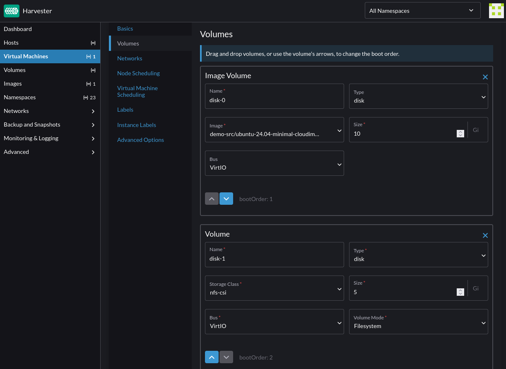
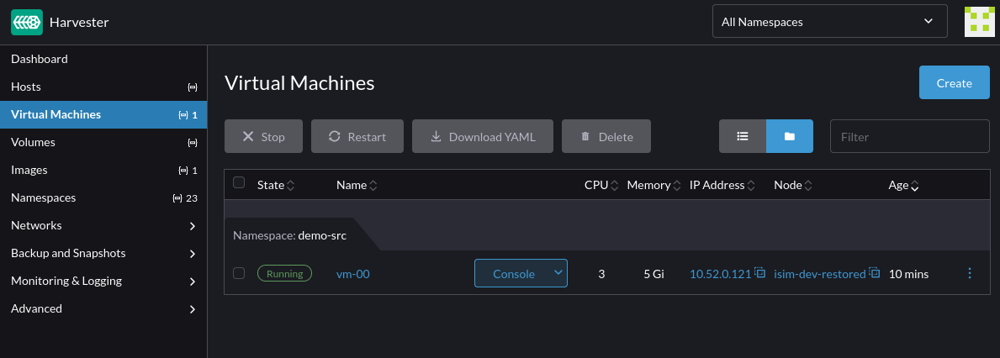

Harvester 1.5 introduces support for the provisioning of virtual machine root volumes and data volumes using external Container Storage Interface (CSI) drivers.

This article demonstrates how to use [Velero 1.16.0](https://velero.io) to perform backup and restore of virtual machines in Harvester.

In particular, it provides commands and manifests to:

* backup virtual machines, their NFS CSI volumes and associated namespace-scoped configuration
* export the backup artifacts to an AWS S3 bucket
* restore to a different namespace on the same cluster
* restore to a different cluster

:::note

The commands and manifests used in this article are tested with Harvester 1.6.0.

The CSI NFS driver and Velero configuration and versions used in this example are for demonstration purposes only. Adjust them according to your environment and requirements.

:::

:::important

The examples provided are intended to backup and restore Linux virtual machine workloads. It is not suitable for backing up guest clusters provisioned via the Harvester Rancher integration.

To backup and restore guest clusters like RKE2, please refer to the distro official documentation.

:::

## Harvester Installation

Refer to the [Harvester documentation](https://docs.harvesterhci.io/v1.6/install/requirements) for installation requirements and options.

The kubeconfig file of the cluster can be retrieved following the instructions [here](https://docs.harvesterhci.io/v1.6/faq/#how-can-i-access-the-kubeconfig-file-of-the-harvester-cluster).

## Install And Configure Velero

Download the [Velero CLI](https://velero.io/docs/v1.16/basic-install/#install-the-cli).

Set the following shell variables:

```sh
BUCKET_NAME=<your-s3-bucket-name>
BUCKET_REGION=<your-s3-bucket-region>
AWS_CREDENTIALS_FILE=<absolute-path-to-your-aws-credentials-file>
```

Install Velero on the Harvester cluster:

```sh
velero install \
  --provider aws \
  --features=EnableCSI \
  --plugins "velero/velero-plugin-for-aws:v1.12.0,quay.io/kubevirt/kubevirt-velero-plugin:v0.7.1" \
  --bucket "${BUCKET_NAME}" \
  --secret-file "${AWS_CREDENTIALS_FILE}" \
  --backup-location-config region="${BUCKET_REGION}" \
  --snapshot-location-config region="${BUCKET_REGION}" \
  --use-node-agent
```

  * In this setup, Velero is configured to:

    * Run in the `velero` namespace
    * Enable CSI volume snapshot APIs
    * Enable the built-in node agent data movement controllers and pods
    * Use the `velero-plugin-for-aws` plugin to manage interactions with the S3 object store
    * Use the `kubevirt-velero-plugin` plugin to backup and restore KubeVirt resources

Confirm that Velero is installed and running:

```sh
kubectl -n velero get po
```

```sh
NAME                      READY   STATUS    RESTARTS         AGE
node-agent-875mr          1/1     Running   0                1d
velero-745645565f-5dqgr   1/1     Running   0                1d
```

Configure the `velero` CLI to output the backup and restore status of CSI objects:

```sh
velero client config set features=EnableCSI
```

## Deploy NFS CSI And Server

Follow the instructions in the [NFS CSI documentation](https://github.com/kubernetes-csi/csi-driver-nfs/blob/master/deploy/example/README.md) to set up the NFS CSI driver, its storage class and an example NFS server.

The NFS CSI volume snapshotting capability must also be enabled following the instructions [here](https://github.com/kubernetes-csi/csi-driver-nfs/tree/master/deploy/example/snapshot).

Confirm that the NFS CSI and example server are running:

```sh
kubectl get po -A -l 'app in (csi-nfs-node,csi-nfs-controller,nfs-server)'
```

```sh
NAMESPACE     NAME                                  READY   STATUS    RESTARTS    AGE
default       nfs-server-b767db8c8-9ltt4            1/1     Running   0           1d
kube-system   csi-nfs-controller-5bf646f7cc-6vfxn   5/5     Running   0           1d
kube-system   csi-nfs-node-9z6pt                    3/3     Running   0           1d
```

The default NFS CSI storage class is named `nfs-csi`:

```sh
kubectl get sc nfs-csi
```

```sh
NAME      PROVISIONER      RECLAIMPOLICY   VOLUMEBINDINGMODE   ALLOWVOLUMEEXPANSION   AGE
nfs-csi   nfs.csi.k8s.io   Delete          Immediate           true                   14d
```

Similarly, the default NFS CSI volume snapshot class is named `csi-nfs-snapclass`:

```sh
kubectl get volumesnapshotclass csi-nfs-snapclass
```

```sh
NAME                DRIVER           DELETIONPOLICY   AGE
csi-nfs-snapclass   nfs.csi.k8s.io   Delete           14d
```

## Preparing The Virtual Machine And Image

Refer to the Harvester documentation on how to perform the following steps using the NFS CSI storage class:

 * [Create a virtual machine image](https://docs.harvesterhci.io/v1.6/advanced/csidriver#virtual-machine-image-creation)
 * [Create a virtual machine](https://docs.harvesterhci.io/v1.6/advanced/csidriver#virtual-machine-creation)

This example uses the [Ubuntu 24.04 raw image](https://cloud-images.ubuntu.com/minimal/releases/noble/) to create a virtual machine with NFS root and data volumes in the custom `demo-src` namespace:



:::note

For CSI snapshotting to work, the NFS volumes must have their `volumeMode` set to `Filesystem`.

:::

Access the virtual machine via SSH, and add some files to both the root and data volumes.

The data volume needs to be partitioned, with a file system created and mounted before files can be written to it.

## Backup The Source Namespace

Use the `velero` CLI to create a backup of the `demo-src` namespace:

```sh
BACKUP_NAME=backup-demo-src-`date "+%s"`

velero backup create "${BACKUP_NAME}" --include-namespaces demo-src
```

This creates a backup containing namespace-scoped resources like the virtual machine, its volumes, image and other associated configuration.

:::important

Velero only uploads Kubernetes objects configuration to the remote backup location, not the data in the CSI snapshots. For more information, refer to the [Velero CSI documentation](https://velero.io/docs/v1.15/csi/#how-it-works---overview).

See also section on [Restore To A Different Cluster](#restore-to-a-different-cluster) below.

:::

Confirm that the backup completed successfully:

```sh
velero backup get "${BACKUP_NAME}"
```

```sh
NAME                         STATUS      ERRORS   WARNINGS   CREATED                         EXPIRES   STORAGE LOCATION   SELECTOR
backup-demo-src-1747954979   Completed   0        0          2025-05-22 16:04:46 -0700 PDT   29d       default            <none>
```

The `velero backup describe` and `velero backup logs` commands can be used to confirm the resources included in the backup.

## Restore To A Different Namespace

This section describes how to restore the backup from the `demo-src` namespace to a new namespace named `demo-dst`:

```sh
velero restore create \
  --from-backup "${BACKUP_NAME}" \
  --namespace-mappings "demo-src:demo-dst" \
  --exclude-resources "virtualmachineimages.harvesterhci.io" \
  --labels "velero.kubevirt.io/clear-mac-address=true,velero.kubevirt.io/generate-new-firmware-uuid=true"
```

 * During the restore:

   * The virtual machine's MAC address and firmware UUID are reset to avoid potential conflicts with existing virtual machines.
   * The virtual machine image manifest is excluded as it is not needed in the new namespace. The restored virtual machine uses the original image.

Confirm that the restore completed successfully:

```sh
velero restore get
```

```sh
NAME                                        BACKUP                       STATUS      STARTED                         COMPLETED                       ERRORS   WARNINGS   CREATED                         SELECTOR
backup-demo-src-1747954979-20250522164015   backup-demo-src-1747954979   Completed   2025-05-22 16:40:15 -0700 PDT   2025-05-22 16:40:49 -0700 PDT   0        6          2025-05-22 16:40:15 -0700 PDT   <none>
```

Confirm that the virtual machine and its configuration are restored to the new `demo-dst` namespace:


Access the new virtual machine via SSH to confirm that all the changes made on the volumes are also restored.

The `velero restore describe` and `velero restore logs` commands provide more insights into the restore operation.

## Restore To A Different Cluster

This section extends the above scenario to demonstrate the steps to restore the backup to a different Harvester cluster using Velero's [CSI data snapshot movement capability](https://velero.io/docs/v1.16/csi-snapshot-data-movement/).

### On The Source Cluster

Perform a full backup of the `demo-src` namespace using Velero's built-in data mover:

```sh
BACKUP_NAME=backup-full-demo-src-`date "+%s"`

velero backup create "${BACKUP_NAME}" \
  --include-namespaces demo-src \
  --snapshot-move-data
```

Depending on the size of the virtual machine and its volumes, the backup may take a while to complete.

The `DataUpload` custom resources provide insights into the backup progress:

```sh
kubectl -n velero get datauploads -l velero.io/backup-name="${BACKUP_NAME}"
```

Wait for the backup to complete, and confirm that it is successful:

```sh
velero backup get "${BACKUP_NAME}"
```

```sh
NAME                              STATUS      ERRORS   WARNINGS   CREATED                         EXPIRES   STORAGE LOCATION   SELECTOR
backup-full-demo-src-1748035987   Completed   0        0          2025-05-23 11:31:06 -0700 PDT   29d       default            <none>
```

After the backup completes, Velero removes the CSI snapshots from the storage side to free up the snapshot data space.

### On The Target Cluster

Install Velero, the NFS CSI and NFS server following the instructions from the [Deploy NFS CSI And Server](#deploy-nfs-csi-and-server) section.

Once Velero is configured to use the same backup location as the source cluster, it automatically discovers the available backups:

```sh
velero backup get
```

```sh
NAME                              STATUS      ERRORS   WARNINGS   CREATED                         EXPIRES   STORAGE LOCATION   SELECTOR
backup-full-demo-src-1748035987   Completed   0        0          2025-05-23 11:31:06 -0700 PDT   29d       default            <none>
```

Set the name of the backup to use:

```sh
BACKUP_NAME=backup-full-demo-src-1748035987
```

Restore the virtual machine image manifest to the `demo-src` namespace:

```sh
velero restore create \
  --from-backup "${BACKUP_NAME}" \
  --include-resources "virtualmachineimages.harvesterhci.io"
```

:::note

In this setup, CDI re-downloads the raw image from the original download URL.

In a future enhancement, the image will be restored directly from the remote backup location.

:::

Restore the backup:

```sh
velero restore create \
  --from-backup "${BACKUP_NAME}" \
  --labels "velero.kubevirt.io/clear-mac-address=true,velero.kubevirt.io/generate-new-firmware-uuid=true"
```

 * During the restore:

   * the virtual machine's MAC address and firmware UUID are reset to avoid potential conflicts with existing virtual machines.
   * the virtual machine image manifest is excluded as it was already restored.

During the restore, the `DataDownload` custom resources can be used to examine the progress of the operation:

```sh
kubectl -n velero get datadownload
```

```sh
NAME                                                   STATUS      STARTED   BYTES DONE   TOTAL BYTES   STORAGE LOCATION   AGE     NODE
backup-full-demo-src-1748035987-20250527125953-7hqzt   Completed   8m37s     3758096384   3758096384    default            8m39s   isim-dev-restored
backup-full-demo-src-1748035987-20250527125953-cgl2k   Completed   5m36s     5073010688   5073010688    default            8m39s   isim-dev-restored
```

Confirm that the virtual machine and its configuration are restored to the `demo-src` namespace:



Access the new virtual machine via SSH to confirm that all the changes made on the volumes are also restored.

The `velero restore describe` and `velero restore logs` commands provide more insights into the restore operation.

:::note

Velero uses [Kopia](https://kopia.io/) as its default data mover. This [issue](https://github.com/kopia/kopia/issues/544#issuecomment-674536833) describes some of its limitations on advanced file system features such as setuid/gid, hardlinks, mount points, sockets, xattr, ACLs, etc.

Depending on your use cases, you can configure custom data movers using Velero's `--data-mover` option. For more information, see the Velero's [documentation](https://velero.io/docs/v1.16/csi-snapshot-data-movement/#customized-data-movers).

:::

## Using Longhorn Volumes

To backup and restore Longhorn volumes, label the Longhorn volume snapshot class `longhorn` as follows:

```sh
kubectl label volumesnapshotclass longhorn velero.io/csi-volumesnapshot-class
```

This informs Velero to use the correct snapshot class when backing up and restoring Longhorn volumes.
