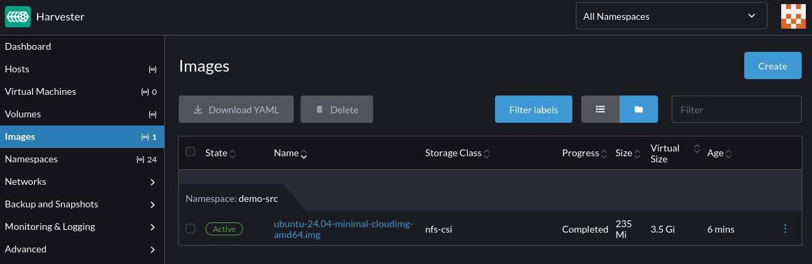
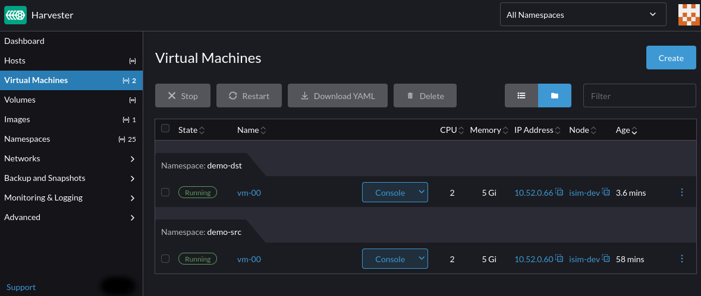

Harvester 1.5 introduces support for the provisioning of virtual machine root volumes and data volumes using external Container Storage Interface (CSI) drivers.

This article demonstrates how to use [Velero 1.16.0](https://velero.io) to perform backup and restore of virtual machines in Harvester.

It goes through commands and manifests to:

* Back up virtual machines in a namespace, their NFS CSI volumes, and associated namespace-scoped configuration
* Export the backup artifacts to an AWS S3 bucket
* Restore to a different namespace on the same cluster
* Restore to a different cluster

Velero is a Kubernetes-native backup and restore tool that enables users to perform scheduled and on-demand backups of virtual machines to external object storage providers such as S3, Azure Blob, or GCS, aligning with enterprise backup and disaster recovery practices.

:::note

The commands and manifests used in this article are tested with Harvester 1.5.1.

The CSI NFS driver and Velero configuration and versions used are for demonstration purposes only. Adjust them according to your environment and requirements.

:::

:::important

The examples provided are intended to backup and restore Linux virtual machine workloads. It is not suitable for backing up guest clusters provisioned via the [Harvester Rancher integration](https://docs.harvesterhci.io/v1.5/rancher/rancher-integration).

To backup and restore guest clusters like RKE2, please refer to the distro [official documentation](https://docs.rke2.io/datastore/backup_restore).

:::

## Harvester Installation

Refer to the [Harvester documentation](https://docs.harvesterhci.io/v1.6/install/requirements) for installation requirements and options.

The kubeconfig file of the Harvester cluster can be retrieved following the instructions [here](https://docs.harvesterhci.io/v1.6/faq/#how-can-i-access-the-kubeconfig-file-of-the-harvester-cluster).

## Install and Configure Velero

Download the [Velero CLI](https://velero.io/docs/v1.16/basic-install/#install-the-cli).

Set the following shell variables:

```sh
BUCKET_NAME=<your-s3-bucket-name>
BUCKET_REGION=<your-s3-bucket-region>
AWS_CREDENTIALS_FILE=<absolute-path-to-your-aws-credentials-file>
```

Install Velero on the Harvester cluster:

```sh
velero install \
  --provider aws \
  --features=EnableCSI \
  --plugins "velero/velero-plugin-for-aws:v1.12.0,quay.io/kubevirt/kubevirt-velero-plugin:v0.7.1" \
  --bucket "${BUCKET_NAME}" \
  --secret-file "${AWS_CREDENTIALS_FILE}" \
  --backup-location-config region="${BUCKET_REGION}" \
  --snapshot-location-config region="${BUCKET_REGION}" \
  --use-node-agent
```

  * In this setup, Velero is configured to:

    * Run in the `velero` namespace
    * Enable CSI volume snapshot APIs
    * Enable the built-in node agent data movement controllers and pods
    * Use the `velero-plugin-for-aws` plugin to manage interactions with the S3 object store
    * Use the `kubevirt-velero-plugin` plugin to backup and restore KubeVirt resources

Confirm that Velero is installed and running:

```sh
kubectl -n velero get po
```

```sh
NAME                      READY   STATUS    RESTARTS         AGE
node-agent-875mr          1/1     Running   0                1d
velero-745645565f-5dqgr   1/1     Running   0                1d
```

Configure the `velero` CLI to output the backup and restore status of CSI objects:

```sh
velero client config set features=EnableCSI
```

## Deploy the NFS CSI and Example Server

Follow the instructions in the [NFS CSI documentation](https://github.com/kubernetes-csi/csi-driver-nfs/blob/master/deploy/example/README.md) to set up the NFS CSI driver, its storage class, and an example NFS server.

The NFS CSI volume snapshotting capability must also be enabled following the instructions [here](https://github.com/kubernetes-csi/csi-driver-nfs/tree/master/deploy/example/snapshot).

Confirm that the NFS CSI and example server are running:

```sh
kubectl get po -A -l 'app in (csi-nfs-node,csi-nfs-controller,nfs-server)'
```

```sh
NAMESPACE     NAME                                  READY   STATUS    RESTARTS    AGE
default       nfs-server-b767db8c8-9ltt4            1/1     Running   0           1d
kube-system   csi-nfs-controller-5bf646f7cc-6vfxn   5/5     Running   0           1d
kube-system   csi-nfs-node-9z6pt                    3/3     Running   0           1d
```

The default NFS CSI storage class is named `nfs-csi`:

```sh
kubectl get sc nfs-csi
```

```sh
NAME      PROVISIONER      RECLAIMPOLICY   VOLUMEBINDINGMODE   ALLOWVOLUMEEXPANSION   AGE
nfs-csi   nfs.csi.k8s.io   Delete          Immediate           true                   14d
```

Confirm that the default NFS CSI volume snapshot class `csi-nfs-snapclass` is also installed:

```sh
kubectl get volumesnapshotclass csi-nfs-snapclass
```

```sh
NAME                DRIVER           DELETIONPOLICY   AGE
csi-nfs-snapclass   nfs.csi.k8s.io   Delete           14d
```

## Preparing the Virtual Machine and Image

Create a custom namespace named `demo-src`:

```sh
kubectl create ns demo-src
```

Follow the instructions in the [Image Management](https://docs.harvesterhci.io/v1.5/image/upload-image/#upload-images-via-url) documentation to upload the Ubuntu 24.04 raw image from https://cloud-images.ubuntu.com/minimal/releases/noble/ to Harvester.

The storage class of the image must be set to `nfs-csi`, per the [Third-Party Storage Support](https://docs.harvesterhci.io/v1.5/advanced/csidriver#virtual-machine-image-creation) documentation.

Confirm the virtual machine image is successfully uploaded to Harvester:



Follow the instructions in the [third-party storage](https://docs.harvesterhci.io/v1.5/advanced/csidriver#virtual-machine-creation) documentation to create a virtual machine with NFS root and data volumes, using the image uploaded in the previous step.

For NFS CSI snapshot to work, the NFS data volume must have the `volumeMode` set to `Filesystem`:


:::note optional

For testing purposes, once the virtual machine is ready, access it via SSH and add some files to both the root and data volumes.

The data volume needs to be partitioned, with a file system created and mounted before files can be written to it.

:::

## Backup the Source Namespace

Use the `velero` CLI to create a backup of the `demo-src` namespace using Velero's built-in data mover:

```sh
BACKUP_NAME=backup-demo-src-`date "+%s"`

velero backup create "${BACKUP_NAME}" \
  --include-namespaces demo-src \
  --snapshot-move-data
```

:::info

For more information on Velero's data mover, see its documentation on [CSI data snapshot movement capability](https://velero.io/docs/v1.16/csi-snapshot-data-movement/).

:::

This creates a backup of the `demo-src` namespace containing resources like the virtual machine created earlier, its volumes, secrets and other associated configuration.

Depending on the size of the virtual machine and its volumes, the backup may take a while to complete.

The `DataUpload` custom resources provide insights into the backup progress:

```sh
kubectl -n velero get datauploads -l velero.io/backup-name="${BACKUP_NAME}"
```

Confirm that the backup completed successfully:

```sh
velero backup get "${BACKUP_NAME}"
```

```sh
NAME                         STATUS      ERRORS   WARNINGS   CREATED                         EXPIRES   STORAGE LOCATION   SELECTOR
backup-demo-src-1747954979   Completed   0        0          2025-05-22 16:04:46 -0700 PDT   29d       default            <none>
```

After the backup completes, Velero removes the CSI snapshots from the storage side to free up the snapshot data space.

:::note tips

The `velero backup describe` and `velero backup logs` commands can be used to assess details of the backup including resources included, skipped, and any warnings or errors encountered during the backup process.

:::

## Restore To A Different Namespace

This section describes how to restore the backup from the `demo-src` namespace to a new namespace named `demo-dst`.

Save the following restore modifier to a local file named `modifier-data-volumes.yaml`:

```yaml
cat <<EOF > modifier-data-volumes.yaml
version: v1
resourceModifierRules:
- conditions:
    groupResource: persistentvolumeclaims
    matches:
    - path: /metadata/annotations/harvesterhci.io~1volumeForVirtualMachine
      value: "\"true\""
  patches:
  - operation: remove
    path: /metadata/annotations/harvesterhci.io~1volumeForVirtualMachine
EOF
```

This restore modifier removes the `harvesterhci.io/volumeForVirtualMachine` annotation from the virtual machine data volumes to ensure that the restoration do not conflict with the CDI volume import populator.

Create the restore modifier:

```sh
kubectl -n velero create cm modifier-data-volumes --from-file=modifier-data-volumes.yaml
```

Assign the backup name to a shell variable:

```sh
BACKUP_NAME=backup-demo-src-1747954979
```

Start the restore operation:

```sh
velero restore create \
  --from-backup "${BACKUP_NAME}" \
  --namespace-mappings "demo-src:demo-dst" \
  --exclude-resources "virtualmachineimages.harvesterhci.io" \
  --resource-modifier-configmap "modifier-data-volumes" \
  --labels "velero.kubevirt.io/clear-mac-address=true,velero.kubevirt.io/generate-new-firmware-uuid=true"
```

 * During the restore:

   * The virtual machine MAC address and firmware UUID are reset to avoid potential conflicts with existing virtual machines.
   * the virtual machine image manifest is excluded because Velero restores the entire state of the virtual machine from the backup.
   * the `modifier-data-volumes` restore modifier is invoked to modify the virtual machine data volumes metadata to prevent conflicts with the CDI volume import populator.

While the restore operation is still in-progress, the `DataDownload` custom resources can be used to examine the progress of the operation:

```sh
RESTORE_NAME=backup-demo-src-1747954979-20250522164015

kubectl -n velero get datadownload -l velero.io/restore-name="${RESTORE_NAME}"
```

Confirm that the restore completed successfully:

```sh
velero restore get
```

```sh
NAME                                        BACKUP                       STATUS      STARTED                         COMPLETED                       ERRORS   WARNINGS   CREATED                         SELECTOR
backup-demo-src-1747954979-20250522164015   backup-demo-src-1747954979   Completed   2025-05-22 16:40:15 -0700 PDT   2025-05-22 16:40:49 -0700 PDT   0        6          2025-05-22 16:40:15 -0700 PDT   <none>
```


Verify that the virtual machine and its configuration are restored to the new `demo-dst` namespace:



:::note

Velero uses [Kopia](https://kopia.io/) as its default data mover. This [issue](https://github.com/kopia/kopia/issues/544#issuecomment-674536833) describes some of its limitations on advanced file system features such as setuid/gid, hard links, mount points, sockets, xattr, ACLs, etc.

Velero provides the `--data-mover` option to configure custom data movers to satisfy different use cases. For more information, see the Velero's [documentation](https://velero.io/docs/v1.16/csi-snapshot-data-movement/#customized-data-movers).

:::

:::note tips

The `velero restore describe` and `velero restore logs` commands provide more insights into the restore operation including the resources restored, skipped, and any warnings or errors encountered during the restore process.

:::

## Restore To A Different Cluster

This section extends the above scenario to demonstrate the steps to restore the backup to a different Harvester cluster.

On the target cluster, install Velero, and set up the NFS CSI and NFS server following the instructions from the [Deploy the NFS CSI and Example Server](#deploy-the-nfs-csi-and-example-server) section.

Once Velero is configured to use the same backup location as the source cluster, it automatically discovers the available backups:

```sh
velero backup get
```

```sh
NAME                         STATUS      ERRORS   WARNINGS   CREATED                         EXPIRES   STORAGE LOCATION   SELECTOR
backup-demo-src-1747954979   Completed   0        0          2025-05-22 16:04:46 -0700 PDT   29d       default            <none>
```

Follow the steps in the [Restore To A Different Namespace](#restore-to-a-different-namespace) section to restore the backup on the target cluster.

Remove the `--namespace-mappings` option to set the restored namespace to `demo-src` on the target cluster.

Confirm that the virtual machine and its configuration are restored to the `demo-src` namespace:


## Select Longhorn Volume Snapshot Class

To perform Velero backup and restore of virtual machines with Longhorn volumes, label the Longhorn volume snapshot class `longhorn` as follows:

```sh
kubectl label volumesnapshotclass longhorn velero.io/csi-volumesnapshot-class
```

This helps Velero to find the correct Longhorn snapshot class to use during backup and restore.

## Limitations

Enhancements related to the limitations described in this section are tracked at https://github.com/harvester/harvester/issues/8367.

* By default, Velero only supports [resource filtering](https://velero.io/docs/v1.16/resource-filtering/) by resource groups and labels. In order to backup/restore a single instance of virtual machine, custom labels must be applied to the virtual machine, and its virtual machine instance, pod, data volumes, persistent volumes claim, persistent volumes and `cloudinit` secret resources. It's recommended to backup the entire namespace and perform resource filtering during restore to ensure that backup contains all the dependency resources required by the virtual machine.

* The restoration of virtual machine image is not fully supported yet.
