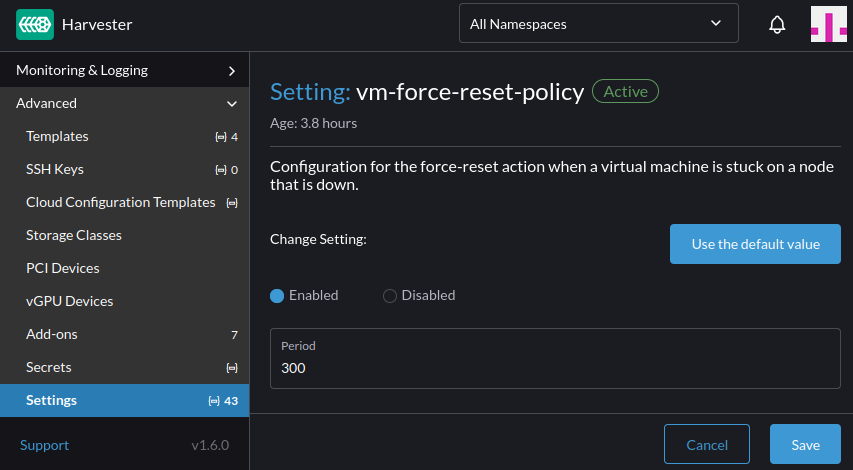

If a Harvester node becomes unreachable, Harvester attempts to reschedule its virtual machines to another healthy node. However, this rescheduling doesn't happen immediately. The associated `virt-launcher` pods may continue to appear to remain in the ready state due to its KubeVirt readiness gate configuration.

To mitigate this elapsed time, you can modify the [`vm-force-reset-policy` setting](https://docs.harvesterhci.io/latest/advanced/index#vm-force-reset-policy), by reducing its `period` value. This enables Harvester to detect non-ready virtual machines on unreachable nodes sooner.

This setting can be found in the `Advanced` -> `Settings` page on the Harvester UI.

Additionally, while the current default is 5 minutes, we are considering reducing the default value [1].

## References

[1] https://github.com/harvester/harvester/issues/8971
