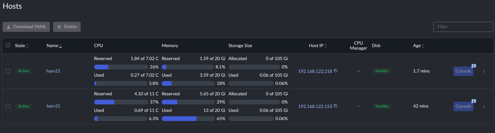
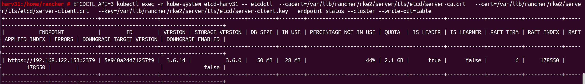
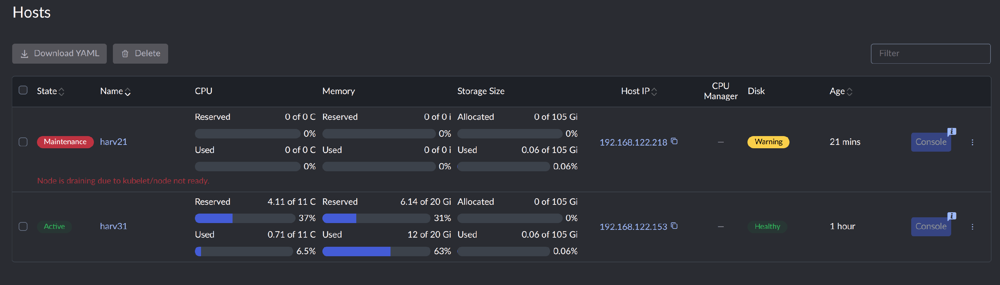
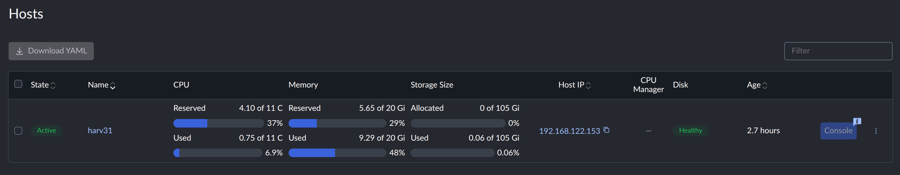
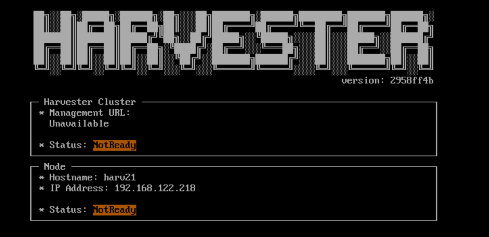

:::warning

1. **Documentation Reference:** Review the official [Harvester Deleting a Node Documentation](https://docs.harvesterhci.io/v1.8/host/#deleting-a-node) for critical prerequisites and safety considerations.

1. **Strict Execution Sequence:** All steps in this document must be executed in strict numerical sequence. If any step encounters an error or produces unexpected output, stop immediately and consult Harvester support or your cluster administration team before proceeding.

:::


A Harvester cluster is booted and managed under the hood using RKE2 and Rancher. In this architecture, the Cluster API (`capi`) `machine` object acts as the functional bridge connecting the underlying Kubernetes `node` object with Rancher's management controller. 

Because of this tightly coupled multi-layer architecture, removing a node in Harvester is more complex than in a standard Kubernetes cluster. Beyond draining workloads and removing the Kubernetes `node` object, you must follow specific RKE2 uninitialization scripts to tear down node-level infrastructure services and explicitly delete the Cluster API `machine` object so Rancher ceases management and reconciliation loops for the host.

## Cluster Baseline

Before initiating any node removal, verify that the cluster state is healthy and that all active Kubernetes `node` objects align 1:1 with their corresponding Cluster API `machine` objects. If any stale or redundant `machine` objects exist from previous failed deployments, delete them before proceeding.

The sample cluster has two nodes, and worker node `harv21` will be removed.



```bash
harv31:/home/rancher # kubectl get nodes -A
NAME     STATUS   ROLES                AGE   VERSION
harv21   Ready    <none>               15m   v1.36.3+rke2r1
harv31   Ready    control-plane,etcd   56m   v1.36.3+rke2r1

harv31:/home/rancher # kubectl get machines -A
NAMESPACE     NAME                  CLUSTER   NODE NAME   FAILURE DOMAIN   READY   AVAILABLE   UP-TO-DATE   PHASE     AGE   VERSION
fleet-local   custom-2b108e6cb5d9   local     harv21                       True    True                     Running   15m   
fleet-local   custom-d9d1ba8f7563   local     harv31                       True    True                     Running   51m
```

Record the machine object name `custom-2b108e6cb5d9`.

:::important

**2-Node Cluster**: In this 2-node sample environment (`harv21` + `harv31`), `harv31` is the sole control-plane and etcd node. You CANNOT delete harv31. Removing the only control-plane node will instantly collapse the Kubernetes API server and permanently break cluster quorum. In a 2-node setup, only worker nodes (like harv21) can be safely decommissioned.

**Single-Node Cluster**: Needless to say, you cannot delete the only node from a single-node cluster. Removing the node destroys the entire cluster control plane and storage layer simultaneously.

:::

### Removing a Control-Plane Node in 3+ Node Clusters

If your cluster has 3 or more control-plane nodes (e.g., a High-Availability setup with harv11, harv21, harv31), deleting a control-plane node is supported, but extra precautions apply:

* **Quorum Health**: etcd requires a strict majority to maintain quorum ($N/2 + 1$). Ensure the remaining control-plane count after removal will form an odd number (or maintain quorum requirements) before taking a node down.

* **Proactive etcd Leadership Transfer**: If the control-plane node scheduled for removal currently holds the active etcd leader role, you MUST explicitly transfer leadership to a surviving control node before executing uninstallation scripts.


#### Control Plane & ETCD Leadership Transfer (Control-Plane Nodes Only)

:::warning

Do not rely on automatic `etcd` election timeouts when taking down a control-plane node. Terminating the active `etcd` leader without prior transfer causes a temporary control-plane freeze while remaining nodes wait for election timeouts. Proactively transferring leadership guarantees zero API server disruption.

:::

If the target node to be removed holds the `control-plane` / `etcd` role, perform leadership verification and manual handover **before** draining or uninstalling software.

1. **Check Current ETCD Leadership**

    Log in to any active control-plane node and query the member list inside the static etcd pod:

    ```bash
    harv31:/home/rancher # ETCDCTL_API=3 kubectl exec -n kube-system etcd-harv31 -- etcdctl \
        --cacert=/var/lib/rancher/rke2/server/tls/etcd/server-ca.crt \
        --cert=/var/lib/rancher/rke2/server/tls/etcd/server-client.crt \
        --key=/var/lib/rancher/rke2/server/tls/etcd/server-client.key \
        endpoint status --cluster -w table
    ```

    

    Locate the target node by its IP address in the ENDPOINT column and evaluate the following:

    - If the target control-plane node has **IS LEADER** set to false, proceed directly to [Prepare the Target Node](#prepare-the-target-node).

    - If the target control-plane node has **IS LEADER** set to true, proceed next step to transfer leadership.

2. **Proactively Move ETCD Leadership**

    1. Select a surviving member node from the endpoint status --cluster table that has **IS LEADER** set to `false` and **IS LEARNER** set to `false`. Record its hexadecimal ID.

    1. Transfer leadership away from the target host to the surviving member ID:

        ```bash
        harv31:/home/rancher # ETCDCTL_API=3 kubectl exec -n kube-system etcd-harv31 -- etcdctl \
            --cacert=/var/lib/rancher/rke2/server/tls/etcd/server-ca.crt \
            --cert=/var/lib/rancher/rke2/server/tls/etcd/server-client.crt \
            --key=/var/lib/rancher/rke2/server/tls/etcd/server-client.key \
            move-leader <TARGET_SURVIVING_MEMBER_ID>
        ```

    1. Re-run `endpoint status --cluster -w table` to confirm that **IS LEADER** has successfully shifted to the surviving node before proceeding.

## Prepare the Target Node

Check the official [Harvester Deleting a Node Documentation](https://docs.harvesterhci.io/v1.8/host/#deleting-a-node) steps before [5. Evict workloads from the node to be removed](https://docs.harvesterhci.io/v1.8/host/#5-evict-workloads-from-the-node-to-be-removed).

:::important

Before cordoning or draining the node, backup/export any critical diagnostic data, custom host configs or persistent host path data to a secure remote host. Once workloads are evicted or the node is uninstalled, local ephemeral data and pod logs might no longer be accessible.

:::

Whenever possible, enable [Maintenance mode](https://docs.harvesterhci.io/v1.8/host/#node-maintenance) on the target node directly from the Harvester UI via **Hosts** > **Action** > **Enable Maintenance Mode**.

If UI maintenance mode is not accessible/not allowed, prepare the node manually using kubectl

```bash
# Cordon the target node to prevent new pod scheduling
kubectl cordon harv21

# Verify that the node status reflects 'SchedulingDisabled'
kubectl get node harv21

# Drain active workloads and local data storage from the node
kubectl drain harv21 --ignore-daemonsets --delete-emptydir-data
```

## Verify Post-Maintenance Cluster Health

Once the target node successfully enters `Maintenance Mode` (or completes its `kubectl drain` cycle), **do not proceed directly to node uninstallation**. Workload migration places extra CPU, memory, network, and disk I/O pressure on surviving nodes. You must verify that the cluster has stabilized before taking irreversible deletion steps.

Perform the following system-level checks on an active control-plane node:

1.  **Node Readiness & Resource Overhead:**
    Verify that all remaining nodes report `Ready` and have sufficient CPU and memory headroom to handle the re-located workloads:
    ```bash
    harv31:/home/rancher # kubectl get nodes
    harv31:/home/rancher # kubectl top nodes
    ```

2.  **Pod & Workload Status:**
    Ensure no evicted pods or virtual machine instances are stuck in `Pending`, `CrashLoopBackOff`, or unschedulable states:
    ```bash
    harv31:/home/rancher # kubectl get pods -A | grep -v -E 'Running|Completed'
    ```

3.  **Abnormal Cluster Events:**
    Check for recent scheduling warnings, resource exhaustion alerts, or failed volume mounts triggered by the eviction:
    ```bash
    harv31:/home/rancher # kubectl get events -A --field-selector type=Warning --sort-by='.metadata.creationTimestamp'
    ```

4.  **Longhorn Storage Health or Third-Party Storage:**
    In the Harvester UI (or Longhorn dashboard / third-party storage management console), verify that all storage volume replicas have finished rebuilding across the remaining hosts and that no volumes remain degraded, degraded-syncing, or in a `Faulted` state.

5.  **Critical System Services & Business Workloads:**
    Confirm that core cluster add-ons and critical business applications have successfully re-established quorum and connectivity:
    *   **Core Infrastructure:** Verify that ingress controllers, CNI networking components (e.g., Canal/Flannel/Cilium), and monitoring stacks are fully functional across surviving nodes.
    *   **VIP / Ingress Traffic:** Ensure VIP services or external load balancer targets have updated and are actively serving production traffic without packet drop or high latency.
    *   **Stateful Workloads:** Validate that stateful applications (e.g., databases, message queues, key-value stores) have re-attached their persistent volumes and recovered cluster synchronization.

6.  **VM Auto-Balance & Migration Thrashing Check:**
    If the [Virtual Machine Auto-Balance addon](https://docs.harvesterhci.io/v1.8/advanced/addons/virtual-machine-auto-balance) is enabled, monitor active migrations in the Harvester UI. Pay close attention to ensure that workload shifts do not trigger cascading, hyper-frequent VM re-balancing migrations across the remaining hosts due to tight CPU/memory thresholds.

7.  **Observation & Stability Window:**
    Allow an observation window (e.g., 30 minutes) before initiating permanent node uninstallation or deletion. Monitor real-time metrics, node load averages, and VM responsiveness to guarantee cluster stability under sustained operational load.

:::warning

**STOP / GO GATE:**

If the cluster exhibits degraded storage, abnormal pods, or resource saturation following workload eviction, **stop immediately**. Fix and recover cluster health before deleting machine or node objects.

:::

## Execute Node Uninstallation Script

:::warning

1. **Target Node Only (`harv21`):**
    The script `/opt/rke2/bin/rke2-uninstall.sh` **MUST ONLY BE RUN DIRECTLY ON THE TARGET NODE BEING REMOVED (`harv21`)**. Running this on `harv31` or another active control node will destroy that node's local cluster services.

1. **Immediate Destruction (No Confirmation Prompt):**
    The `/opt/rke2/bin/rke2-uninstall.sh` script **does NOT ask for double confirmation or prompt `y/n`** before execution. Once invoked, it immediately stops services and tears down the node environment. Double-check your active hostname (`hostname`) before pressing Enter.

:::

Log in to `harv21` via SSH/console as the `root` user and execute the pre-installed script:

```bash
harv21:/home/rancher # hostname
harv21

harv21:/home/rancher # /opt/rke2/bin/rke2-uninstall.sh
++ id -u
...
...
...
+ echo -e '\e[31mCleanup didn'\''t complete successfully\e[0m'
Cleanup didn't complete successfully
+ log 'Removing uninstall script'
++ date '+%Y-%m-%d %H:%M:%S'
+ echo '[2026-08-05 13:25:09] Removing uninstall script'
[2026-08-05 13:25:09] Removing uninstall script
+ rm -f -- /opt/rke2/bin/rke2-uninstall.sh

```

:::note

If the script outputs errors (e.g., Cleanup didn't complete successfully), re-run the script or contact Harvester Support.

:::

**Verification**:

Once the script finishes, verify that RKE2 services and virtual interfaces have been stopped.

1. Check process termination:

    ```bash
    harv21:/home/rancher # ps aux | grep kubelet
    # Expected output: Only the grep process itself should return
    ```

1. Check network interfaces:

    ```bash
    harv21:/home/rancher # ip link
    # Expected output: Only physical interfaces and management bridges remain active
    # no output like `56: cali05b22ce82b3@if2:`
    ```

1. Check Harvester UI.

    The hosts `harv21` shows a warning message `Node is draining due to kubelet/node not ready`, as the `kubelet` on it had been gone.

    


## Remove the Machine Object

Before deleting the Kubernetes `node` object, you **must** delete its associated Cluster API (`capi`) `machine` object first. Otherwise, Rancher's controller will detect a state mismatch and automatically recreate the `node` object in an attempt to reconcile the cluster.

As an expected result of the uninstallation script, the `machine` object for `harv21` now reflects `Unknown` in the `READY` column and `False` under `AVAILABLE`. Run the following steps to delete it:

1.  **Verify the machine state across namespaces:**
    ```bash
    harv31:/home/rancher # kubectl get machine -A
    NAMESPACE     NAME                  CLUSTER   NODE NAME   FAILURE DOMAIN   READY     AVAILABLE   UP-TO-DATE   PHASE     AGE   VERSION
    fleet-local   custom-2b108e6cb5d9   local     harv21                       Unknown   False                    Running   30m   
    fleet-local   custom-d9d1ba8f7563   local     harv31                       True      True                     Running   66m   
    ```

1.  **Delete the CAPI machine object:**
    ```bash
    harv31:/home/rancher # kubectl delete machine -n fleet-local custom-2b108e6cb5d9
    machine.cluster.x-k8s.io "custom-2b108e6cb5d9" deleted from fleet-local namespace
    ```

1.  **Confirm successful machine object deletion:**
    ```bash
    harv31:/home/rancher # kubectl get machine -A
    NAMESPACE     NAME                  CLUSTER   NODE NAME   FAILURE DOMAIN   READY   AVAILABLE   UP-TO-DATE   PHASE     AGE   VERSION
    fleet-local   custom-d9d1ba8f7563   local     harv31                       True    True                     Running   66m   
    ```


## Remove the Node Object

Deleting the `machine` object disassociates the node from Rancher's management layer. To complete the `node` removal from the cluster, you must explicitly delete the Kubernetes `node` object using one of the following methods:

**Option A: Via Harvester UI (Recommended)**

1. Navigate to the **Hosts** page in the Harvester UI.

1. Locate the target node (`harv21`).

1. Select **⋮ > Delete**.

**Option B: Via `kubectl` CLI**

1. Verify the current node list:
    ```bash
    kubectl get nodes
    ```

1. Delete the `node` object:
    ```bash
    kubectl delete node harv21
    ```

1. Confirm that `harv21` is no longer listed in the cluster.

:::note

If the deleted node still appears as a stale entry record in the Harvester UI, force refresh your browser page (`Ctrl+F5` or `Cmd+Shift+R`) to reload the **Hosts** list.

:::




## Post-Removal Disk Cleanup

The uninstallation script tears down container runtimes and Kubernetes configurations, but it **does not** wipe local storage drives or bootloader partitions.

If `harv21` is rebooted without disk formatting, it will load leftover installation data locally (as shown on its physical or virtual console below). However, this is strictly a local artifact—the Harvester cluster is not affected by it.



:::warning

To prevent residual storage conflicts (such as stale Longhorn volume metadata) or unexpected data leakage when hardware is repurposed:

1. **Hand Off to Infrastructure / Storage Admins:**
    Forward the decommissioned host to your IT infrastructure or system administration team to perform drive sanitization according to your organization's data retention and hardware lifecycle policies.

1. **OS Drive Safety:**
    Avoid attempting to run raw disk-wiping utilities (such as `wipefs` or `dd`) on the active OS root disk while booted into the system, as destroying mounted filesystems will cause immediate kernel panics and data corruption.

1. **Re-imaging:**

    If the node is being re-added to a Harvester cluster, the target OS drive can be safely wiped and reformatted directly via the Harvester installer ISO during the standard boot setup.

:::
